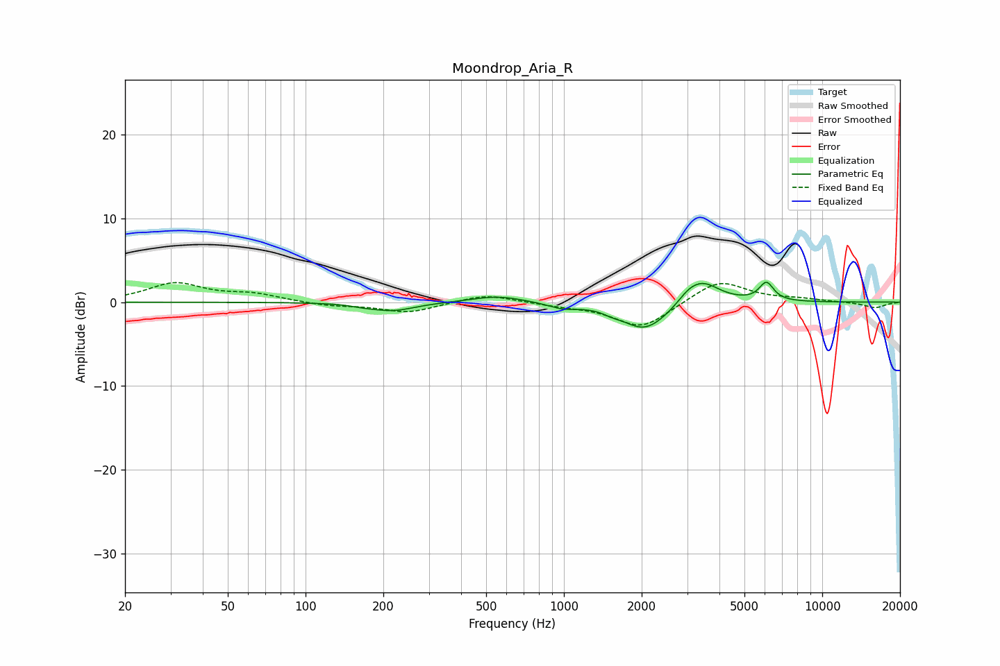

# Moondrop_Aria_R
See [usage instructions](https://github.com/jaakkopasanen/AutoEq#usage) for more options and info.

### Parametric EQs
Apply preamp of -2.5 dB when using parametric equalizer.

|   # | Type    |   Fc (Hz) |    Q |   Gain (dB) |
|-----|---------|-----------|------|-------------|
|   1 | Peaking |       167 | 3.36 |        -0.2 |
|   2 | Peaking |       217 | 1.64 |        -1   |
|   3 | Peaking |       554 | 1.4  |         0.8 |
|   4 | Peaking |       989 | 2.56 |        -0.6 |
|   5 | Peaking |      1531 | 4.64 |        -0.3 |
|   6 | Peaking |      2028 | 1.68 |        -2.8 |
|   7 | Peaking |      2357 | 1.41 |        -0.8 |
|   8 | Peaking |      3014 | 3.79 |         0.6 |
|   9 | Peaking |      3399 | 1.99 |         2.9 |
|  10 | Peaking |      6081 | 4.96 |         2.2 |

### Fixed Band EQs
When using fixed band (also called graphic) equalizer, apply preamp of **-2.4 dB** (if available) and set gains manually with these parameters.

|   # | Type    |   Fc (Hz) |    Q |   Gain (dB) |
|-----|---------|-----------|------|-------------|
|   1 | Peaking |        31 | 1.41 |         2.2 |
|   2 | Peaking |        62 | 1.41 |         0.9 |
|   3 | Peaking |       125 | 1.41 |        -0.4 |
|   4 | Peaking |       250 | 1.41 |        -1.2 |
|   5 | Peaking |       500 | 1.41 |         1   |
|   6 | Peaking |      1000 | 1.41 |        -0.3 |
|   7 | Peaking |      2000 | 1.41 |        -3.1 |
|   8 | Peaking |      4000 | 1.41 |         2.7 |
|   9 | Peaking |      8000 | 1.41 |         0.3 |
|  10 | Peaking |     16000 | 1.41 |        -0.7 |

### Graphs

