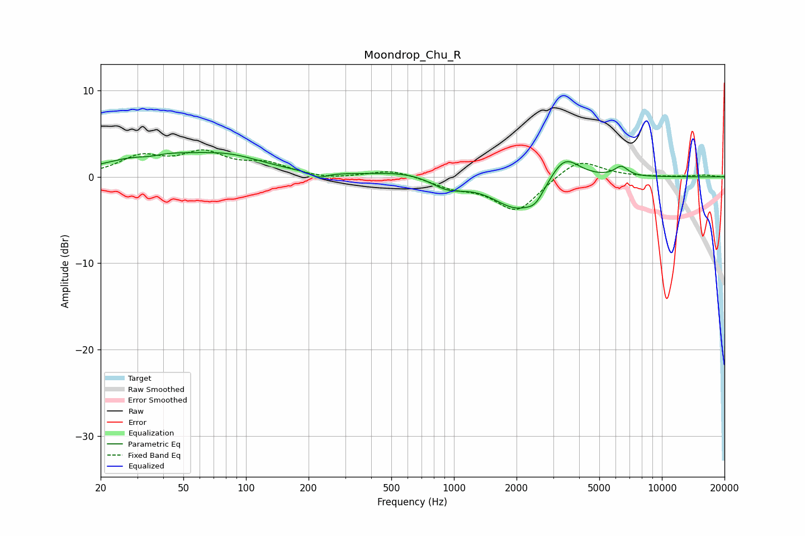

# Moondrop_Chu_R
See [usage instructions](https://github.com/jaakkopasanen/AutoEq#usage) for more options and info.

### Parametric EQs
Apply preamp of -2.9 dB when using parametric equalizer.

|   # | Type    |   Fc (Hz) |    Q |   Gain (dB) |
|-----|---------|-----------|------|-------------|
|   1 | Peaking |        34 | 2.01 |        -0.6 |
|   2 | Peaking |        35 | 0.73 |         2.4 |
|   3 | Peaking |        83 | 0.79 |         1.9 |
|   4 | Peaking |       224 | 3.7  |        -0.6 |
|   5 | Peaking |       605 | 0.87 |         0.7 |
|   6 | Peaking |       930 | 1.69 |        -1.3 |
|   7 | Peaking |      2034 | 1.19 |        -3.8 |
|   8 | Peaking |      2469 | 3.68 |        -1.1 |
|   9 | Peaking |      3386 | 1.93 |         3.2 |
|  10 | Peaking |      6378 | 4.19 |         1.2 |

### Fixed Band EQs
When using fixed band (also called graphic) equalizer, apply preamp of **-3.2 dB** (if available) and set gains manually with these parameters.

|   # | Type    |   Fc (Hz) |    Q |   Gain (dB) |
|-----|---------|-----------|------|-------------|
|   1 | Peaking |        31 | 1.41 |         2.1 |
|   2 | Peaking |        62 | 1.41 |         2.5 |
|   3 | Peaking |       125 | 1.41 |         1.3 |
|   4 | Peaking |       250 | 1.41 |        -0.3 |
|   5 | Peaking |       500 | 1.41 |         0.9 |
|   6 | Peaking |      1000 | 1.41 |        -1.1 |
|   7 | Peaking |      2000 | 1.41 |        -4   |
|   8 | Peaking |      4000 | 1.41 |         2.2 |
|   9 | Peaking |      8000 | 1.41 |        -0   |
|  10 | Peaking |     16000 | 1.41 |         0.2 |

### Graphs

