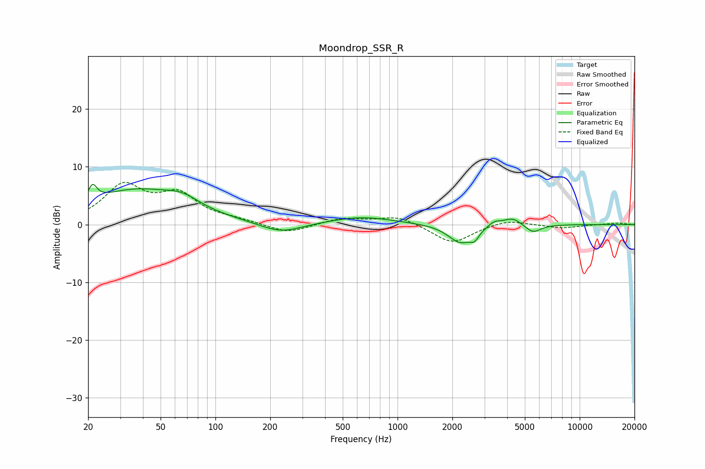

# Moondrop_SSR_R
See [usage instructions](https://github.com/jaakkopasanen/AutoEq#usage) for more options and info.

### Parametric EQs
Apply preamp of -7.0 dB when using parametric equalizer.

|   # | Type    |   Fc (Hz) |    Q |   Gain (dB) |
|-----|---------|-----------|------|-------------|
|   1 | Peaking |        21 | 6    |         2.7 |
|   2 | Peaking |        36 | 0.54 |         5.8 |
|   3 | Peaking |        66 | 1.56 |         1.6 |
|   4 | Peaking |       228 | 1.21 |        -1.8 |
|   5 | Peaking |       634 | 0.81 |         1.3 |
|   6 | Peaking |      2211 | 2.13 |        -3.1 |
|   7 | Peaking |      2646 | 5.74 |        -1.4 |
|   8 | Peaking |      3392 | 4.36 |         0.8 |
|   9 | Peaking |      4275 | 2.72 |         1.4 |
|  10 | Peaking |      5536 | 3.21 |        -1.5 |

### Fixed Band EQs
When using fixed band (also called graphic) equalizer, apply preamp of **-7.4 dB** (if available) and set gains manually with these parameters.

|   # | Type    |   Fc (Hz) |    Q |   Gain (dB) |
|-----|---------|-----------|------|-------------|
|   1 | Peaking |        31 | 1.41 |         6.4 |
|   2 | Peaking |        62 | 1.41 |         4.7 |
|   3 | Peaking |       125 | 1.41 |         0.6 |
|   4 | Peaking |       250 | 1.41 |        -1.6 |
|   5 | Peaking |       500 | 1.41 |         1.1 |
|   6 | Peaking |      1000 | 1.41 |         1.5 |
|   7 | Peaking |      2000 | 1.41 |        -3.3 |
|   8 | Peaking |      4000 | 1.41 |         0.9 |
|   9 | Peaking |      8000 | 1.41 |        -0.6 |
|  10 | Peaking |     16000 | 1.41 |         0.3 |

### Graphs

