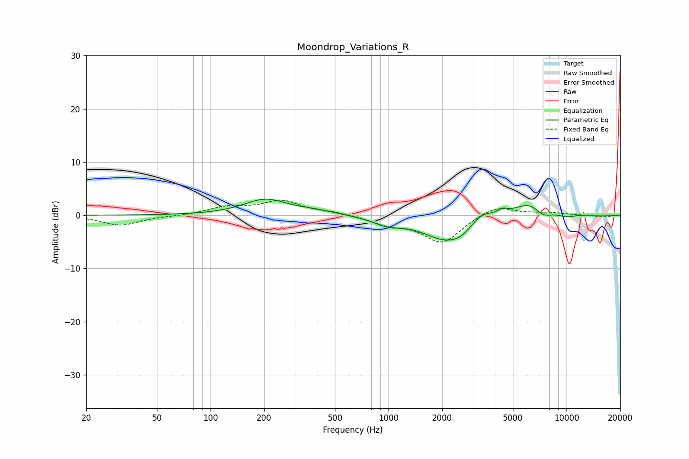

# Moondrop_Variations_R
See [usage instructions](https://github.com/jaakkopasanen/AutoEq#usage) for more options and info.

### Parametric EQs
Apply preamp of -3.1 dB when using parametric equalizer.

|   # | Type    |   Fc (Hz) |    Q |   Gain (dB) |
|-----|---------|-----------|------|-------------|
|   1 | Peaking |       204 | 1.15 |         2.9 |
|   2 | Peaking |       391 | 1.24 |         0.6 |
|   3 | Peaking |       986 | 1.78 |        -1.3 |
|   4 | Peaking |      2128 | 1.04 |        -4.6 |
|   5 | Peaking |      2559 | 2.62 |        -0.9 |
|   6 | Peaking |      3337 | 2.24 |         2   |
|   7 | Peaking |      4368 | 5.62 |         0.8 |
|   8 | Peaking |      6317 | 1.41 |         3   |
|   9 | Peaking |      7345 | 2.64 |        -1.8 |
|  10 | Peaking |     10000 | 2.44 |        -0.6 |

### Fixed Band EQs
When using fixed band (also called graphic) equalizer, apply preamp of **-2.9 dB** (if available) and set gains manually with these parameters.

|   # | Type    |   Fc (Hz) |    Q |   Gain (dB) |
|-----|---------|-----------|------|-------------|
|   1 | Peaking |        31 | 1.41 |        -1.9 |
|   2 | Peaking |        62 | 1.41 |        -0.1 |
|   3 | Peaking |       125 | 1.41 |         1.4 |
|   4 | Peaking |       250 | 1.41 |         2.6 |
|   5 | Peaking |       500 | 1.41 |         0.5 |
|   6 | Peaking |      1000 | 1.41 |        -1.5 |
|   7 | Peaking |      2000 | 1.41 |        -5.2 |
|   8 | Peaking |      4000 | 1.41 |         2   |
|   9 | Peaking |      8000 | 1.41 |         0.4 |
|  10 | Peaking |     16000 | 1.41 |        -0.3 |

### Graphs

