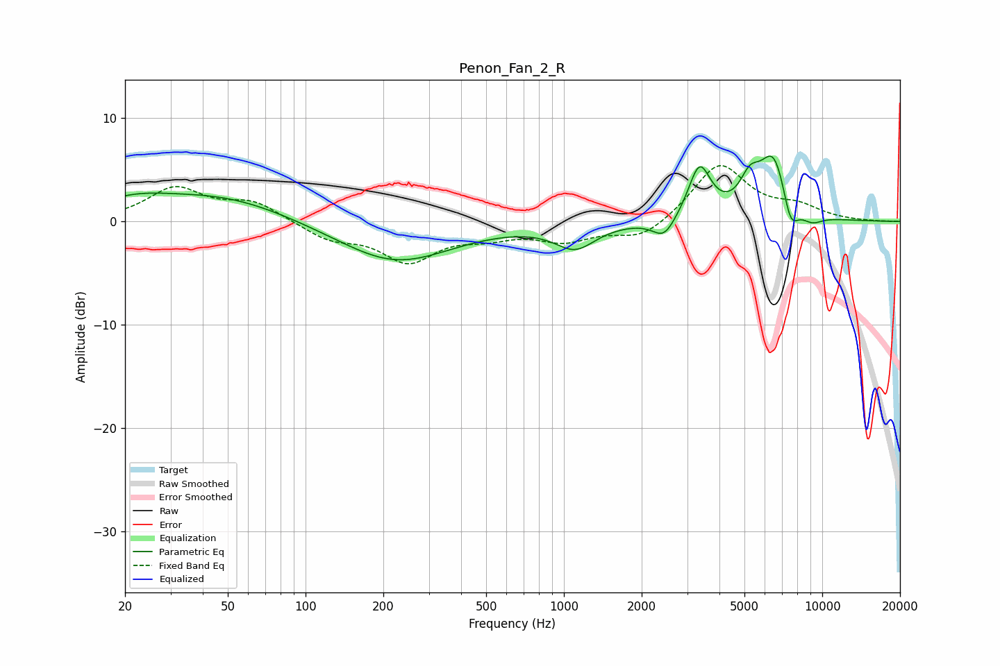

# Penon_Fan_2_R
See [usage instructions](https://github.com/jaakkopasanen/AutoEq#usage) for more options and info.

### Parametric EQs
Apply preamp of -6.4 dB when using parametric equalizer.

|   # | Type    |   Fc (Hz) |    Q |   Gain (dB) |
|-----|---------|-----------|------|-------------|
|   1 | Peaking |        21 | 0.91 |         1.6 |
|   2 | Peaking |        48 | 0.56 |         2.3 |
|   3 | Peaking |       222 | 0.65 |        -4   |
|   4 | Peaking |      1106 | 1.8  |        -2.4 |
|   5 | Peaking |      2444 | 3.21 |        -1.9 |
|   6 | Peaking |      3350 | 3.25 |         5.2 |
|   7 | Peaking |      5245 | 3.57 |         2.6 |
|   8 | Peaking |      6502 | 2.36 |         6.4 |
|   9 | Peaking |      7532 | 4.27 |        -3.3 |
|  10 | Peaking |      9094 | 3.01 |        -0.9 |

### Fixed Band EQs
When using fixed band (also called graphic) equalizer, apply preamp of **-5.5 dB** (if available) and set gains manually with these parameters.

|   # | Type    |   Fc (Hz) |    Q |   Gain (dB) |
|-----|---------|-----------|------|-------------|
|   1 | Peaking |        31 | 1.41 |         3.1 |
|   2 | Peaking |        62 | 1.41 |         1.8 |
|   3 | Peaking |       125 | 1.41 |        -1.6 |
|   4 | Peaking |       250 | 1.41 |        -3.6 |
|   5 | Peaking |       500 | 1.41 |        -1.1 |
|   6 | Peaking |      1000 | 1.41 |        -1.7 |
|   7 | Peaking |      2000 | 1.41 |        -1.8 |
|   8 | Peaking |      4000 | 1.41 |         5.6 |
|   9 | Peaking |      8000 | 1.41 |         1.2 |
|  10 | Peaking |     16000 | 1.41 |        -0   |

### Graphs

