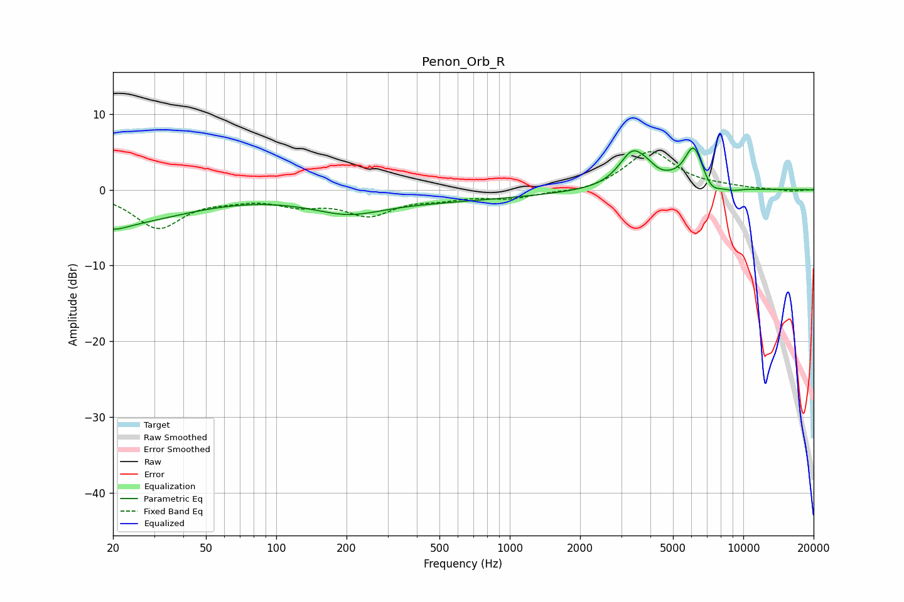

# Penon_Orb_R
See [usage instructions](https://github.com/jaakkopasanen/AutoEq#usage) for more options and info.

### Parametric EQs
Apply preamp of -5.6 dB when using parametric equalizer.

|   # | Type    |   Fc (Hz) |    Q |   Gain (dB) |
|-----|---------|-----------|------|-------------|
|   1 | Peaking |        20 | 2.3  |        -1   |
|   2 | Peaking |        21 | 0.47 |        -4.2 |
|   3 | Peaking |       202 | 0.95 |        -1.8 |
|   4 | Peaking |       396 | 0.29 |        -1.4 |
|   5 | Peaking |      3364 | 2.37 |         4.8 |
|   6 | Peaking |      3908 | 3.63 |         0.7 |
|   7 | Peaking |      4918 | 3.85 |         0.2 |
|   8 | Peaking |      6133 | 3.39 |         5.5 |
|   9 | Peaking |      7302 | 3.69 |        -1.3 |
|  10 | Peaking |      8966 | 3    |        -0.4 |

### Fixed Band EQs
When using fixed band (also called graphic) equalizer, apply preamp of **-5.1 dB** (if available) and set gains manually with these parameters.

|   # | Type    |   Fc (Hz) |    Q |   Gain (dB) |
|-----|---------|-----------|------|-------------|
|   1 | Peaking |        31 | 1.41 |        -4.9 |
|   2 | Peaking |        62 | 1.41 |        -0.7 |
|   3 | Peaking |       125 | 1.41 |        -1.6 |
|   4 | Peaking |       250 | 1.41 |        -3   |
|   5 | Peaking |       500 | 1.41 |        -0.9 |
|   6 | Peaking |      1000 | 1.41 |        -1   |
|   7 | Peaking |      2000 | 1.41 |        -0.4 |
|   8 | Peaking |      4000 | 1.41 |         5.1 |
|   9 | Peaking |      8000 | 1.41 |         0.3 |
|  10 | Peaking |     16000 | 1.41 |        -0.2 |

### Graphs

