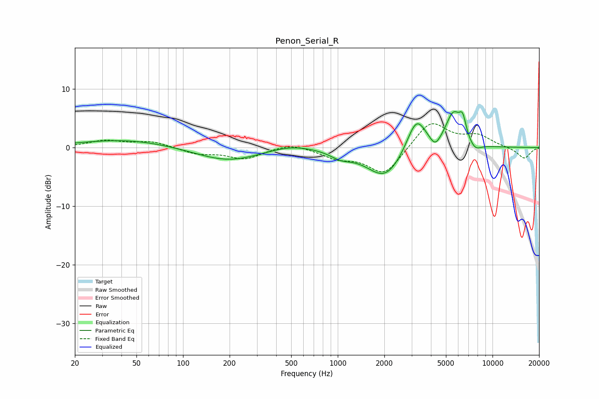

# Penon_Serial_R
See [usage instructions](https://github.com/jaakkopasanen/AutoEq#usage) for more options and info.

### Parametric EQs
Apply preamp of -6.2 dB when using parametric equalizer.

|   # | Type    |   Fc (Hz) |    Q |   Gain (dB) |
|-----|---------|-----------|------|-------------|
|   1 | Peaking |        43 | 0.49 |         1.4 |
|   2 | Peaking |       196 | 0.68 |        -2.4 |
|   3 | Peaking |       496 | 0.94 |         1   |
|   4 | Peaking |      1046 | 2.06 |        -1.1 |
|   5 | Peaking |      2033 | 1.19 |        -5.4 |
|   6 | Peaking |      3221 | 2.19 |         6.1 |
|   7 | Peaking |      4257 | 4.12 |        -1.8 |
|   8 | Peaking |      5577 | 2.81 |         5.6 |
|   9 | Peaking |      6415 | 6    |         3.2 |
|  10 | Peaking |      7711 | 3.49 |        -1.3 |

### Fixed Band EQs
When using fixed band (also called graphic) equalizer, apply preamp of **-4.2 dB** (if available) and set gains manually with these parameters.

|   # | Type    |   Fc (Hz) |    Q |   Gain (dB) |
|-----|---------|-----------|------|-------------|
|   1 | Peaking |        31 | 1.41 |         1.1 |
|   2 | Peaking |        62 | 1.41 |         1   |
|   3 | Peaking |       125 | 1.41 |        -1   |
|   4 | Peaking |       250 | 1.41 |        -1.9 |
|   5 | Peaking |       500 | 1.41 |         0.9 |
|   6 | Peaking |      1000 | 1.41 |        -1.6 |
|   7 | Peaking |      2000 | 1.41 |        -4.7 |
|   8 | Peaking |      4000 | 1.41 |         4.6 |
|   9 | Peaking |      8000 | 1.41 |         1.9 |
|  10 | Peaking |     16000 | 1.41 |        -1.9 |

### Graphs

