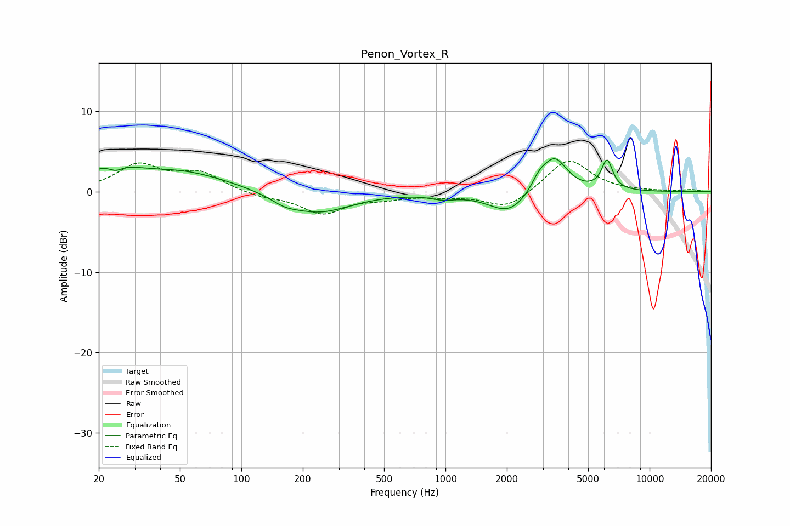

# Penon_Vortex_R
See [usage instructions](https://github.com/jaakkopasanen/AutoEq#usage) for more options and info.

### Parametric EQs
Apply preamp of -4.2 dB when using parametric equalizer.

|   # | Type    |   Fc (Hz) |    Q |   Gain (dB) |
|-----|---------|-----------|------|-------------|
|   1 | Peaking |        23 | 1.33 |         2.6 |
|   2 | Peaking |        24 | 3.69 |        -1.1 |
|   3 | Peaking |        51 | 0.59 |         2.4 |
|   4 | Peaking |       163 | 2.2  |        -0.7 |
|   5 | Peaking |       237 | 0.89 |        -2.6 |
|   6 | Peaking |       974 | 2.37 |        -0.5 |
|   7 | Peaking |      2050 | 1.43 |        -2.8 |
|   8 | Peaking |      2877 | 3.76 |         1.4 |
|   9 | Peaking |      3428 | 2.27 |         4.3 |
|  10 | Peaking |      6192 | 5.02 |         3.7 |

### Fixed Band EQs
When using fixed band (also called graphic) equalizer, apply preamp of **-3.9 dB** (if available) and set gains manually with these parameters.

|   # | Type    |   Fc (Hz) |    Q |   Gain (dB) |
|-----|---------|-----------|------|-------------|
|   1 | Peaking |        31 | 1.41 |         3.2 |
|   2 | Peaking |        62 | 1.41 |         2.2 |
|   3 | Peaking |       125 | 1.41 |        -0.6 |
|   4 | Peaking |       250 | 1.41 |        -2.6 |
|   5 | Peaking |       500 | 1.41 |        -0.6 |
|   6 | Peaking |      1000 | 1.41 |        -0.4 |
|   7 | Peaking |      2000 | 1.41 |        -2.1 |
|   8 | Peaking |      4000 | 1.41 |         4.2 |
|   9 | Peaking |      8000 | 1.41 |         0   |
|  10 | Peaking |     16000 | 1.41 |         0.2 |

### Graphs

