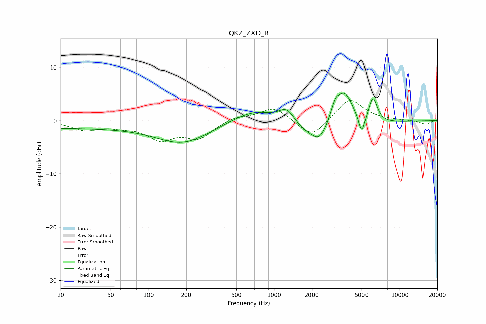

# QKZ_ZXD_R
See [usage instructions](https://github.com/jaakkopasanen/AutoEq#usage) for more options and info.

### Parametric EQs
Apply preamp of -5.2 dB when using parametric equalizer.

|   # | Type    |   Fc (Hz) |    Q |   Gain (dB) |
|-----|---------|-----------|------|-------------|
|   1 | Peaking |        20 | 0.19 |        -1.3 |
|   2 | Peaking |       189 | 0.66 |        -4   |
|   3 | Peaking |       751 | 0.74 |         3.7 |
|   4 | Peaking |      1265 | 2.06 |         3.4 |
|   5 | Peaking |      1930 | 0.43 |        -4.2 |
|   6 | Peaking |      2274 | 2.71 |        -2   |
|   7 | Peaking |      3073 | 3.82 |         2.8 |
|   8 | Peaking |      3648 | 1.91 |         7   |
|   9 | Peaking |      4998 | 5.71 |        -3.5 |
|  10 | Peaking |      6138 | 3.99 |         4.8 |

### Fixed Band EQs
When using fixed band (also called graphic) equalizer, apply preamp of **-3.9 dB** (if available) and set gains manually with these parameters.

|   # | Type    |   Fc (Hz) |    Q |   Gain (dB) |
|-----|---------|-----------|------|-------------|
|   1 | Peaking |        31 | 1.41 |        -1.6 |
|   2 | Peaking |        62 | 1.41 |        -0.8 |
|   3 | Peaking |       125 | 1.41 |        -3.2 |
|   4 | Peaking |       250 | 1.41 |        -3.1 |
|   5 | Peaking |       500 | 1.41 |         0.8 |
|   6 | Peaking |      1000 | 1.41 |         2.6 |
|   7 | Peaking |      2000 | 1.41 |        -3.3 |
|   8 | Peaking |      4000 | 1.41 |         4.3 |
|   9 | Peaking |      8000 | 1.41 |         0.1 |
|  10 | Peaking |     16000 | 1.41 |        -0.6 |

### Graphs

