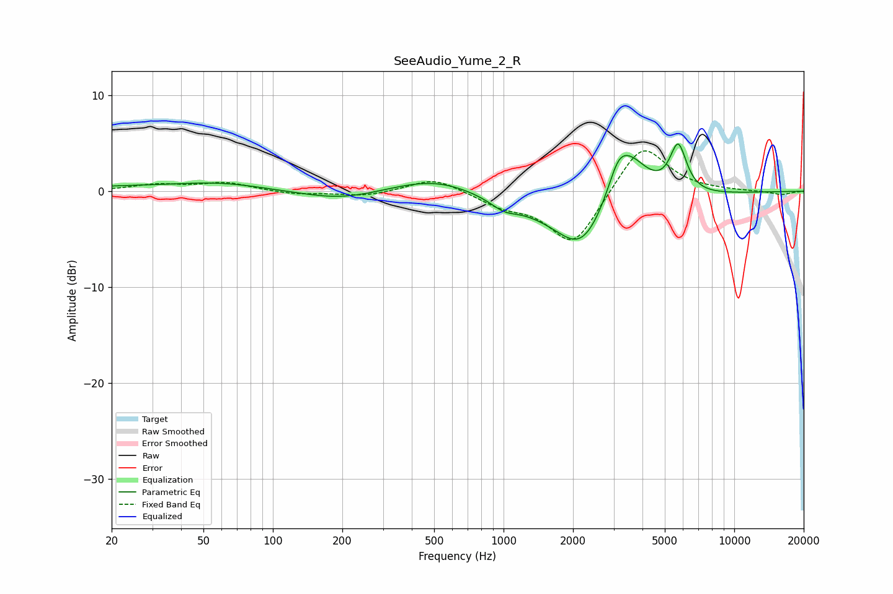

# SeeAudio_Yume_2_R
See [usage instructions](https://github.com/jaakkopasanen/AutoEq#usage) for more options and info.

### Parametric EQs
Apply preamp of -5.0 dB when using parametric equalizer.

|   # | Type    |   Fc (Hz) |    Q |   Gain (dB) |
|-----|---------|-----------|------|-------------|
|   1 | Peaking |        26 | 0.36 |         0.5 |
|   2 | Peaking |        60 | 0.77 |         0.6 |
|   3 | Peaking |       197 | 0.83 |        -1   |
|   4 | Peaking |       508 | 0.77 |         1.7 |
|   5 | Peaking |      1003 | 2.51 |        -0.9 |
|   6 | Peaking |      2187 | 1.35 |        -4.6 |
|   7 | Peaking |      2343 | 0.45 |        -2.6 |
|   8 | Peaking |      3130 | 3.43 |         2   |
|   9 | Peaking |      3461 | 1.51 |         6   |
|  10 | Peaking |      5713 | 3.82 |         5   |

### Fixed Band EQs
When using fixed band (also called graphic) equalizer, apply preamp of **-4.3 dB** (if available) and set gains manually with these parameters.

|   # | Type    |   Fc (Hz) |    Q |   Gain (dB) |
|-----|---------|-----------|------|-------------|
|   1 | Peaking |        31 | 1.41 |         0.6 |
|   2 | Peaking |        62 | 1.41 |         0.9 |
|   3 | Peaking |       125 | 1.41 |        -0.3 |
|   4 | Peaking |       250 | 1.41 |        -0.5 |
|   5 | Peaking |       500 | 1.41 |         1.5 |
|   6 | Peaking |      1000 | 1.41 |        -1.3 |
|   7 | Peaking |      2000 | 1.41 |        -5.7 |
|   8 | Peaking |      4000 | 1.41 |         5.2 |
|   9 | Peaking |      8000 | 1.41 |         0   |
|  10 | Peaking |     16000 | 1.41 |        -0.4 |

### Graphs

