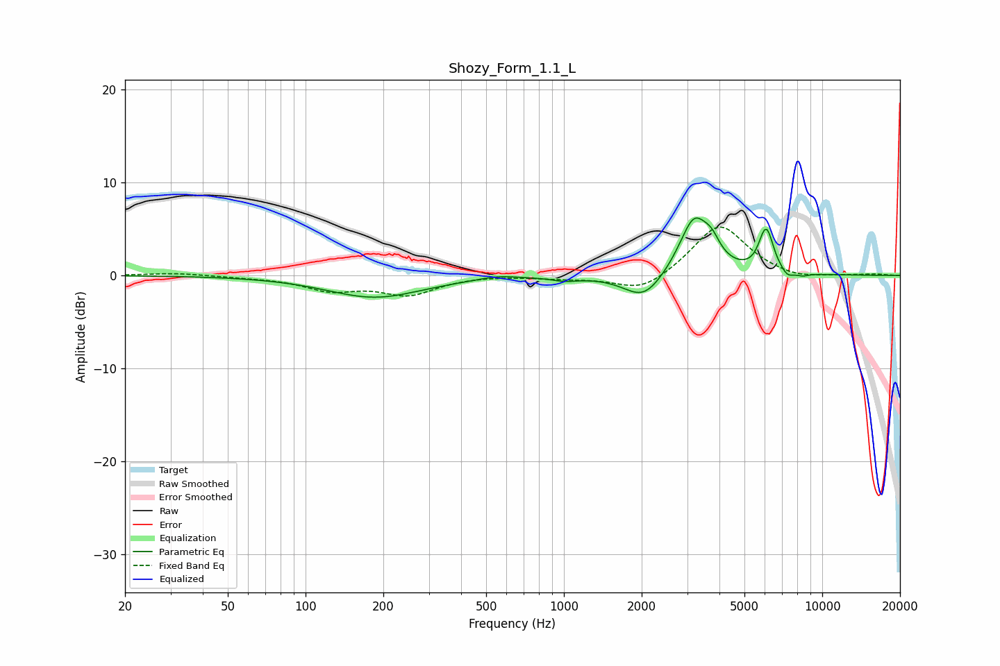

# Shozy_Form_1.1_L
See [usage instructions](https://github.com/jaakkopasanen/AutoEq#usage) for more options and info.

### Parametric EQs
Apply preamp of -6.3 dB when using parametric equalizer.

|   # | Type    |   Fc (Hz) |    Q |   Gain (dB) |
|-----|---------|-----------|------|-------------|
|   1 | Peaking |       185 | 0.76 |        -2.3 |
|   2 | Peaking |       554 | 2.05 |         0.4 |
|   3 | Peaking |      1008 | 2.86 |        -0.4 |
|   4 | Peaking |      2038 | 1.85 |        -2.8 |
|   5 | Peaking |      3194 | 2.41 |         6.3 |
|   6 | Peaking |      3738 | 4.52 |         1.5 |
|   7 | Peaking |      5899 | 5.98 |         1.2 |
|   8 | Peaking |      6121 | 5.2  |         3.7 |
|   9 | Peaking |      7335 | 6    |        -0.7 |
|  10 | Peaking |      8373 | 5.17 |        -0.3 |

### Fixed Band EQs
When using fixed band (also called graphic) equalizer, apply preamp of **-5.3 dB** (if available) and set gains manually with these parameters.

|   # | Type    |   Fc (Hz) |    Q |   Gain (dB) |
|-----|---------|-----------|------|-------------|
|   1 | Peaking |        31 | 1.41 |         0.3 |
|   2 | Peaking |        62 | 1.41 |        -0.1 |
|   3 | Peaking |       125 | 1.41 |        -1.5 |
|   4 | Peaking |       250 | 1.41 |        -1.9 |
|   5 | Peaking |       500 | 1.41 |         0.1 |
|   6 | Peaking |      1000 | 1.41 |        -0.3 |
|   7 | Peaking |      2000 | 1.41 |        -1.9 |
|   8 | Peaking |      4000 | 1.41 |         5.6 |
|   9 | Peaking |      8000 | 1.41 |        -0.5 |
|  10 | Peaking |     16000 | 1.41 |         0.1 |

### Graphs

