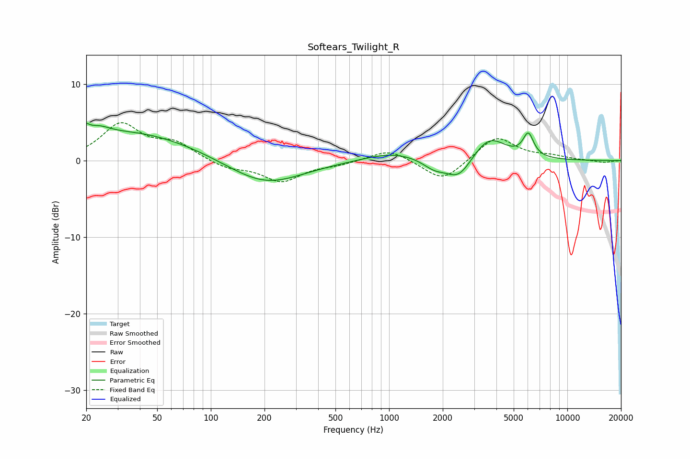

# Softears_Twilight_R
See [usage instructions](https://github.com/jaakkopasanen/AutoEq#usage) for more options and info.

### Parametric EQs
Apply preamp of -5.0 dB when using parametric equalizer.

|   # | Type    |   Fc (Hz) |    Q |   Gain (dB) |
|-----|---------|-----------|------|-------------|
|   1 | Peaking |        20 | 5.93 |         3.1 |
|   2 | Peaking |        20 | 5.98 |        -2   |
|   3 | Peaking |        23 | 2.16 |         1.2 |
|   4 | Peaking |        36 | 0.39 |         3.7 |
|   5 | Peaking |       201 | 0.68 |        -3.3 |
|   6 | Peaking |      1046 | 0.89 |         1.2 |
|   7 | Peaking |      1793 | 2.2  |        -1.2 |
|   8 | Peaking |      2458 | 1.96 |        -2.8 |
|   9 | Peaking |      3642 | 1.53 |         3.2 |
|  10 | Peaking |      6040 | 4.6  |         3   |

### Fixed Band EQs
When using fixed band (also called graphic) equalizer, apply preamp of **-5.1 dB** (if available) and set gains manually with these parameters.

|   # | Type    |   Fc (Hz) |    Q |   Gain (dB) |
|-----|---------|-----------|------|-------------|
|   1 | Peaking |        31 | 1.41 |         4.6 |
|   2 | Peaking |        62 | 1.41 |         2.1 |
|   3 | Peaking |       125 | 1.41 |        -1   |
|   4 | Peaking |       250 | 1.41 |        -2.6 |
|   5 | Peaking |       500 | 1.41 |        -0.5 |
|   6 | Peaking |      1000 | 1.41 |         1.6 |
|   7 | Peaking |      2000 | 1.41 |        -2.8 |
|   8 | Peaking |      4000 | 1.41 |         3.2 |
|   9 | Peaking |      8000 | 1.41 |         0.5 |
|  10 | Peaking |     16000 | 1.41 |        -0.3 |

### Graphs

