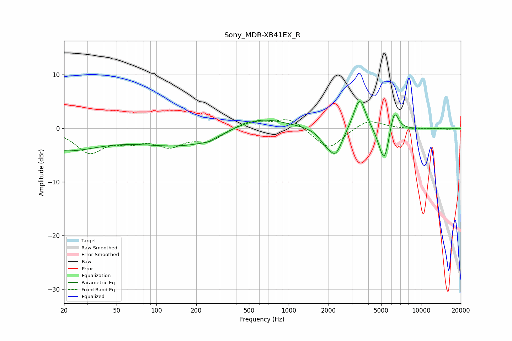

# Sony_MDR-XB41EX_R
See [usage instructions](https://github.com/jaakkopasanen/AutoEq#usage) for more options and info.

### Parametric EQs
Apply preamp of -5.1 dB when using parametric equalizer.

|   # | Type    |   Fc (Hz) |    Q |   Gain (dB) |
|-----|---------|-----------|------|-------------|
|   1 | Peaking |        20 | 0.51 |        -3.9 |
|   2 | Peaking |       178 | 0.38 |        -3.4 |
|   3 | Peaking |       243 | 4.18 |        -0.3 |
|   4 | Peaking |       365 | 1.58 |         0.3 |
|   5 | Peaking |       582 | 0.72 |         2.9 |
|   6 | Peaking |      1868 | 2.99 |        -1.4 |
|   7 | Peaking |      2258 | 2.65 |        -4.9 |
|   8 | Peaking |      3436 | 3.05 |         6.3 |
|   9 | Peaking |      5275 | 3.38 |        -7.1 |
|  10 | Peaking |      6260 | 4.04 |         4.8 |

### Fixed Band EQs
When using fixed band (also called graphic) equalizer, apply preamp of **-1.7 dB** (if available) and set gains manually with these parameters.

|   # | Type    |   Fc (Hz) |    Q |   Gain (dB) |
|-----|---------|-----------|------|-------------|
|   1 | Peaking |        31 | 1.41 |        -4.3 |
|   2 | Peaking |        62 | 1.41 |        -1.9 |
|   3 | Peaking |       125 | 1.41 |        -2.9 |
|   4 | Peaking |       250 | 1.41 |        -2.2 |
|   5 | Peaking |       500 | 1.41 |         1.4 |
|   6 | Peaking |      1000 | 1.41 |         2   |
|   7 | Peaking |      2000 | 1.41 |        -4   |
|   8 | Peaking |      4000 | 1.41 |         1.8 |
|   9 | Peaking |      8000 | 1.41 |        -0.1 |
|  10 | Peaking |     16000 | 1.41 |        -0.2 |

### Graphs

