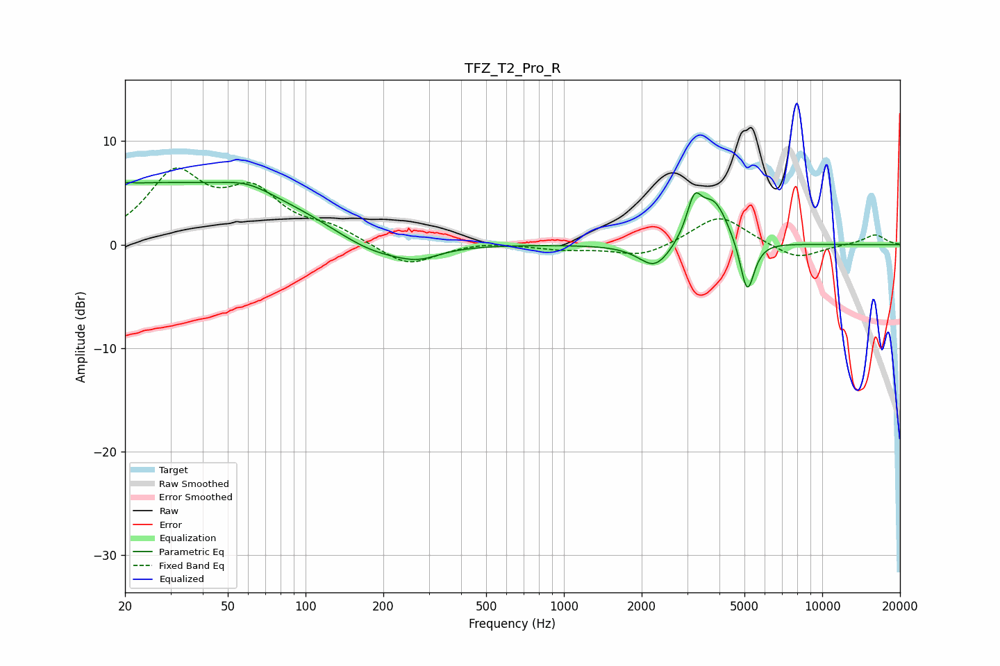

# TFZ_T2_Pro_R
See [usage instructions](https://github.com/jaakkopasanen/AutoEq#usage) for more options and info.

### Parametric EQs
Apply preamp of -6.1 dB when using parametric equalizer.

|   # | Type    |   Fc (Hz) |    Q |   Gain (dB) |
|-----|---------|-----------|------|-------------|
|   1 | Peaking |        21 | 5.77 |         2.7 |
|   2 | Peaking |        21 | 5.88 |        -2.5 |
|   3 | Peaking |        28 | 0.21 |         6   |
|   4 | Peaking |        59 | 1.54 |         0.9 |
|   5 | Peaking |       183 | 0.83 |        -2.5 |
|   6 | Peaking |       274 | 1.73 |        -1   |
|   7 | Peaking |      2254 | 2.26 |        -2.5 |
|   8 | Peaking |      3194 | 4.98 |         3.5 |
|   9 | Peaking |      3814 | 2.45 |         4.2 |
|  10 | Peaking |      5125 | 5.03 |        -5.3 |

### Fixed Band EQs
When using fixed band (also called graphic) equalizer, apply preamp of **-7.5 dB** (if available) and set gains manually with these parameters.

|   # | Type    |   Fc (Hz) |    Q |   Gain (dB) |
|-----|---------|-----------|------|-------------|
|   1 | Peaking |        31 | 1.41 |         6.5 |
|   2 | Peaking |        62 | 1.41 |         4.5 |
|   3 | Peaking |       125 | 1.41 |         1.3 |
|   4 | Peaking |       250 | 1.41 |        -2.1 |
|   5 | Peaking |       500 | 1.41 |         0.3 |
|   6 | Peaking |      1000 | 1.41 |        -0.4 |
|   7 | Peaking |      2000 | 1.41 |        -1.2 |
|   8 | Peaking |      4000 | 1.41 |         2.9 |
|   9 | Peaking |      8000 | 1.41 |        -1.5 |
|  10 | Peaking |     16000 | 1.41 |         1   |

### Graphs

