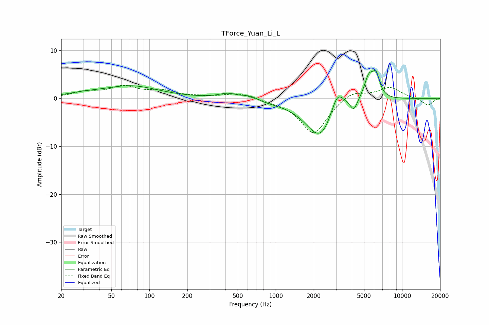

# TForce_Yuan_Li_L
See [usage instructions](https://github.com/jaakkopasanen/AutoEq#usage) for more options and info.

### Parametric EQs
Apply preamp of -5.9 dB when using parametric equalizer.

|   # | Type    |   Fc (Hz) |    Q |   Gain (dB) |
|-----|---------|-----------|------|-------------|
|   1 | Peaking |        30 | 1.04 |         0.6 |
|   2 | Peaking |        71 | 0.66 |         2.5 |
|   3 | Peaking |       417 | 1.94 |         1   |
|   4 | Peaking |       637 | 1.82 |         1.4 |
|   5 | Peaking |       724 | 1.11 |        -0.8 |
|   6 | Peaking |      2273 | 1.19 |        -8.7 |
|   7 | Peaking |      3078 | 2.55 |         5.4 |
|   8 | Peaking |      4156 | 5.35 |        -2.1 |
|   9 | Peaking |      5461 | 3.58 |         4.8 |
|  10 | Peaking |      6238 | 4.68 |         4.1 |

### Fixed Band EQs
When using fixed band (also called graphic) equalizer, apply preamp of **-2.8 dB** (if available) and set gains manually with these parameters.

|   # | Type    |   Fc (Hz) |    Q |   Gain (dB) |
|-----|---------|-----------|------|-------------|
|   1 | Peaking |        31 | 1.41 |         1.2 |
|   2 | Peaking |        62 | 1.41 |         2.2 |
|   3 | Peaking |       125 | 1.41 |         1.4 |
|   4 | Peaking |       250 | 1.41 |         0.2 |
|   5 | Peaking |       500 | 1.41 |         1.1 |
|   6 | Peaking |      1000 | 1.41 |        -0.3 |
|   7 | Peaking |      2000 | 1.41 |        -7.5 |
|   8 | Peaking |      4000 | 1.41 |         1.8 |
|   9 | Peaking |      8000 | 1.41 |         2.3 |
|  10 | Peaking |     16000 | 1.41 |        -1.5 |

### Graphs

