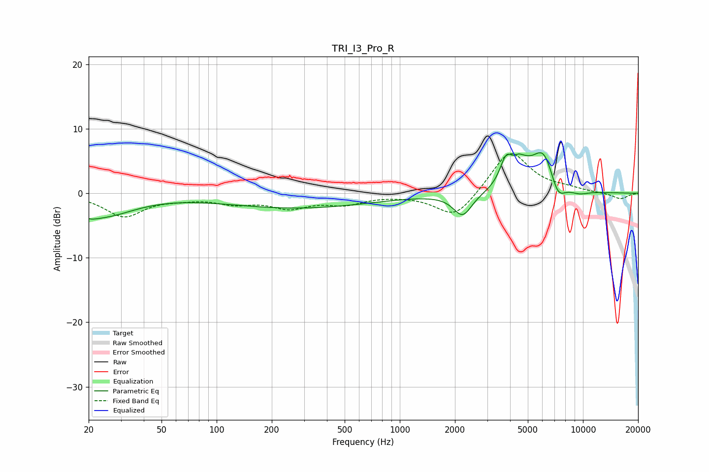

# TRI_I3_Pro_R
See [usage instructions](https://github.com/jaakkopasanen/AutoEq#usage) for more options and info.

### Parametric EQs
Apply preamp of -6.4 dB when using parametric equalizer.

|   # | Type    |   Fc (Hz) |    Q |   Gain (dB) |
|-----|---------|-----------|------|-------------|
|   1 | Peaking |        20 | 2.87 |        -0.8 |
|   2 | Peaking |        24 | 0.83 |        -3.3 |
|   3 | Peaking |       278 | 0.35 |        -2.3 |
|   4 | Peaking |      2203 | 2.79 |        -3.5 |
|   5 | Peaking |      3813 | 3.97 |         4.2 |
|   6 | Peaking |      4426 | 5.29 |         1.1 |
|   7 | Peaking |      4753 | 2.69 |         2.1 |
|   8 | Peaking |      6108 | 2.07 |         6.5 |
|   9 | Peaking |      7265 | 3.15 |        -3.4 |
|  10 | Peaking |      9523 | 2.42 |        -0.6 |

### Fixed Band EQs
When using fixed band (also called graphic) equalizer, apply preamp of **-6.2 dB** (if available) and set gains manually with these parameters.

|   # | Type    |   Fc (Hz) |    Q |   Gain (dB) |
|-----|---------|-----------|------|-------------|
|   1 | Peaking |        31 | 1.41 |        -3.5 |
|   2 | Peaking |        62 | 1.41 |        -0.5 |
|   3 | Peaking |       125 | 1.41 |        -1.3 |
|   4 | Peaking |       250 | 1.41 |        -2   |
|   5 | Peaking |       500 | 1.41 |        -1.5 |
|   6 | Peaking |      1000 | 1.41 |        -0.1 |
|   7 | Peaking |      2000 | 1.41 |        -4   |
|   8 | Peaking |      4000 | 1.41 |         6.8 |
|   9 | Peaking |      8000 | 1.41 |         0.5 |
|  10 | Peaking |     16000 | 1.41 |        -0.9 |

### Graphs

