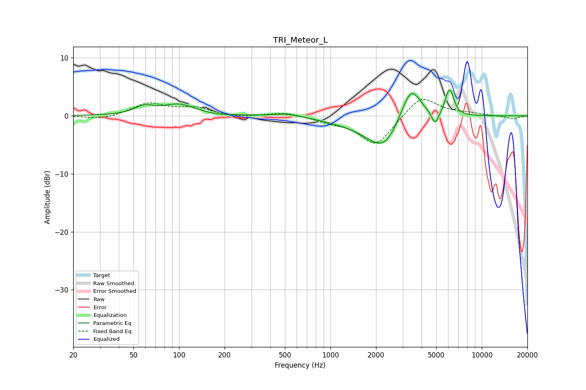

# TRI_Meteor_L
See [usage instructions](https://github.com/jaakkopasanen/AutoEq#usage) for more options and info.

### Parametric EQs
Apply preamp of -4.6 dB when using parametric equalizer.

|   # | Type    |   Fc (Hz) |    Q |   Gain (dB) |
|-----|---------|-----------|------|-------------|
|   1 | Peaking |        59 | 2.25 |         1.3 |
|   2 | Peaking |       100 | 1.33 |         1.9 |
|   3 | Peaking |       176 | 2.01 |        -0.2 |
|   4 | Peaking |       518 | 1.49 |         0.6 |
|   5 | Peaking |      1653 | 0.69 |        -1.3 |
|   6 | Peaking |      2247 | 1.38 |        -4.9 |
|   7 | Peaking |      3397 | 2.12 |         6.3 |
|   8 | Peaking |      4909 | 5.99 |        -2.3 |
|   9 | Peaking |      6044 | 5.54 |         3.4 |
|  10 | Peaking |      6330 | 5.99 |         1.5 |

### Fixed Band EQs
When using fixed band (also called graphic) equalizer, apply preamp of **-2.9 dB** (if available) and set gains manually with these parameters.

|   # | Type    |   Fc (Hz) |    Q |   Gain (dB) |
|-----|---------|-----------|------|-------------|
|   1 | Peaking |        31 | 1.41 |        -0.7 |
|   2 | Peaking |        62 | 1.41 |         2.1 |
|   3 | Peaking |       125 | 1.41 |         1.3 |
|   4 | Peaking |       250 | 1.41 |        -0.3 |
|   5 | Peaking |       500 | 1.41 |         0.7 |
|   6 | Peaking |      1000 | 1.41 |        -0.8 |
|   7 | Peaking |      2000 | 1.41 |        -5.2 |
|   8 | Peaking |      4000 | 1.41 |         3.6 |
|   9 | Peaking |      8000 | 1.41 |         0.4 |
|  10 | Peaking |     16000 | 1.41 |        -0.6 |

### Graphs

