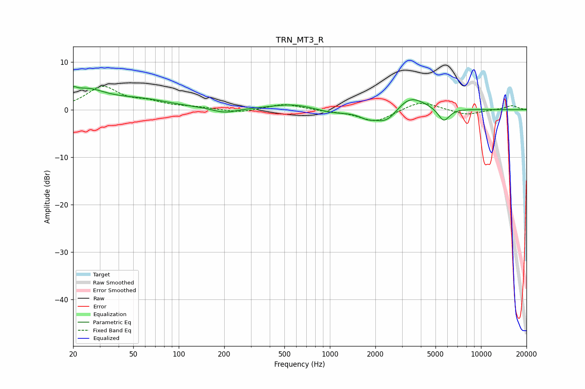

# TRN_MT3_R
See [usage instructions](https://github.com/jaakkopasanen/AutoEq#usage) for more options and info.

### Parametric EQs
Apply preamp of -4.9 dB when using parametric equalizer.

|   # | Type    |   Fc (Hz) |    Q |   Gain (dB) |
|-----|---------|-----------|------|-------------|
|   1 | Peaking |        20 | 5.9  |         1.3 |
|   2 | Peaking |        24 | 1.14 |         3.6 |
|   3 | Peaking |        55 | 0.67 |         1.9 |
|   4 | Peaking |       202 | 1.82 |        -1   |
|   5 | Peaking |       573 | 0.96 |         1.3 |
|   6 | Peaking |      1040 | 1.21 |        -0.9 |
|   7 | Peaking |      1766 | 2.7  |        -1.1 |
|   8 | Peaking |      2377 | 1.77 |        -3.3 |
|   9 | Peaking |      3362 | 1.41 |         3.5 |
|  10 | Peaking |      5671 | 3.68 |        -2.9 |

### Fixed Band EQs
When using fixed band (also called graphic) equalizer, apply preamp of **-5.0 dB** (if available) and set gains manually with these parameters.

|   # | Type    |   Fc (Hz) |    Q |   Gain (dB) |
|-----|---------|-----------|------|-------------|
|   1 | Peaking |        31 | 1.41 |         4.7 |
|   2 | Peaking |        62 | 1.41 |         1.3 |
|   3 | Peaking |       125 | 1.41 |         0.4 |
|   4 | Peaking |       250 | 1.41 |        -0.7 |
|   5 | Peaking |       500 | 1.41 |         1.3 |
|   6 | Peaking |      1000 | 1.41 |        -0.3 |
|   7 | Peaking |      2000 | 1.41 |        -2.6 |
|   8 | Peaking |      4000 | 1.41 |         1.9 |
|   9 | Peaking |      8000 | 1.41 |        -1.1 |
|  10 | Peaking |     16000 | 1.41 |         0.9 |

### Graphs

