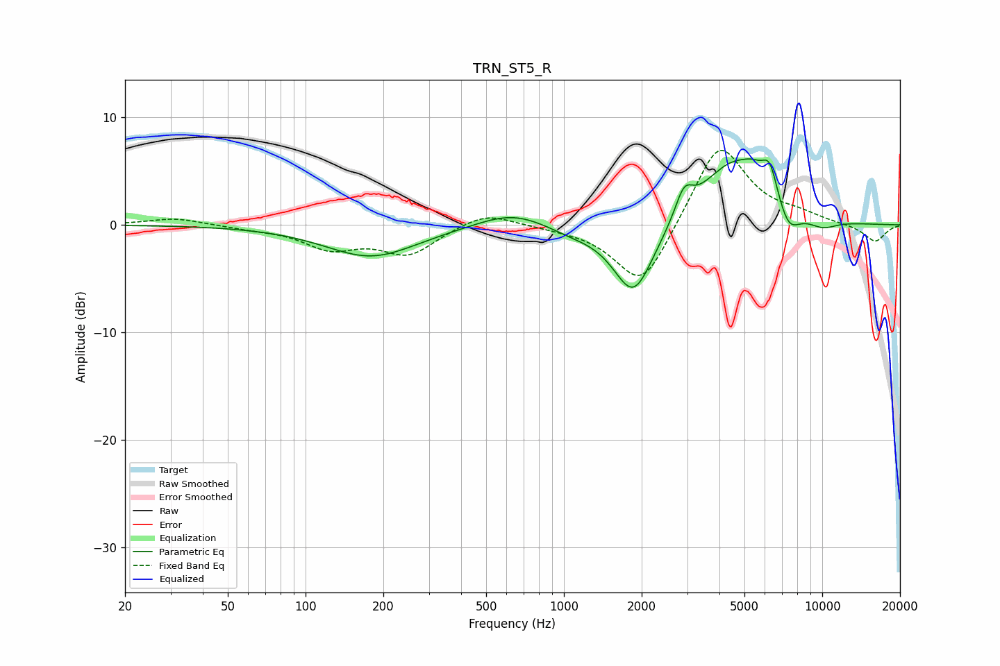

# TRN_ST5_R
See [usage instructions](https://github.com/jaakkopasanen/AutoEq#usage) for more options and info.

### Parametric EQs
Apply preamp of -6.2 dB when using parametric equalizer.

|   # | Type    |   Fc (Hz) |    Q |   Gain (dB) |
|-----|---------|-----------|------|-------------|
|   1 | Peaking |       180 | 0.79 |        -3   |
|   2 | Peaking |       630 | 1.05 |         1.5 |
|   3 | Peaking |      1067 | 1.46 |        -0.6 |
|   4 | Peaking |      1862 | 1.75 |        -6.9 |
|   5 | Peaking |      2916 | 4.19 |         2.5 |
|   6 | Peaking |      4489 | 1.09 |         5.8 |
|   7 | Peaking |      5405 | 3.18 |         1   |
|   8 | Peaking |      6262 | 4.43 |         3   |
|   9 | Peaking |      7403 | 3.06 |        -2.4 |
|  10 | Peaking |     10000 | 2.15 |        -0.9 |

### Fixed Band EQs
When using fixed band (also called graphic) equalizer, apply preamp of **-7.0 dB** (if available) and set gains manually with these parameters.

|   # | Type    |   Fc (Hz) |    Q |   Gain (dB) |
|-----|---------|-----------|------|-------------|
|   1 | Peaking |        31 | 1.41 |         0.7 |
|   2 | Peaking |        62 | 1.41 |        -0.3 |
|   3 | Peaking |       125 | 1.41 |        -2   |
|   4 | Peaking |       250 | 1.41 |        -2.6 |
|   5 | Peaking |       500 | 1.41 |         1.3 |
|   6 | Peaking |      1000 | 1.41 |        -0.2 |
|   7 | Peaking |      2000 | 1.41 |        -6.1 |
|   8 | Peaking |      4000 | 1.41 |         7.9 |
|   9 | Peaking |      8000 | 1.41 |         0.7 |
|  10 | Peaking |     16000 | 1.41 |        -1.6 |

### Graphs

