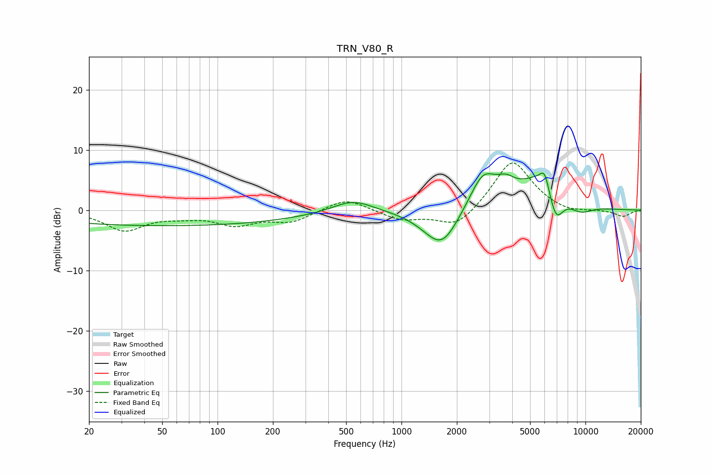

# TRN_V80_R
See [usage instructions](https://github.com/jaakkopasanen/AutoEq#usage) for more options and info.

### Parametric EQs
Apply preamp of -6.3 dB when using parametric equalizer.

|   # | Type    |   Fc (Hz) |    Q |   Gain (dB) |
|-----|---------|-----------|------|-------------|
|   1 | Peaking |        53 | 0.18 |        -2.6 |
|   2 | Peaking |       543 | 1.28 |         2.1 |
|   3 | Peaking |      1499 | 1.3  |        -1.2 |
|   4 | Peaking |      1668 | 1.56 |        -5.4 |
|   5 | Peaking |      2774 | 1.88 |         5.8 |
|   6 | Peaking |      3703 | 2.8  |         2   |
|   7 | Peaking |      5836 | 1.16 |         6   |
|   8 | Peaking |      5998 | 5.92 |         2.5 |
|   9 | Peaking |      6905 | 3.19 |        -5.7 |
|  10 | Peaking |      9371 | 1.93 |        -1.6 |

### Fixed Band EQs
When using fixed band (also called graphic) equalizer, apply preamp of **-7.9 dB** (if available) and set gains manually with these parameters.

|   # | Type    |   Fc (Hz) |    Q |   Gain (dB) |
|-----|---------|-----------|------|-------------|
|   1 | Peaking |        31 | 1.41 |        -3.3 |
|   2 | Peaking |        62 | 1.41 |        -0.7 |
|   3 | Peaking |       125 | 1.41 |        -2.2 |
|   4 | Peaking |       250 | 1.41 |        -1.8 |
|   5 | Peaking |       500 | 1.41 |         2.1 |
|   6 | Peaking |      1000 | 1.41 |        -1.6 |
|   7 | Peaking |      2000 | 1.41 |        -3.1 |
|   8 | Peaking |      4000 | 1.41 |         8.5 |
|   9 | Peaking |      8000 | 1.41 |        -0.7 |
|  10 | Peaking |     16000 | 1.41 |        -1.1 |

### Graphs

