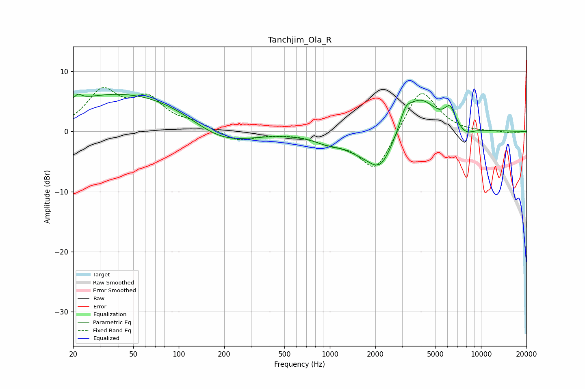

# Tanchjim_Ola_R
See [usage instructions](https://github.com/jaakkopasanen/AutoEq#usage) for more options and info.

### Parametric EQs
Apply preamp of -6.3 dB when using parametric equalizer.

|   # | Type    |   Fc (Hz) |    Q |   Gain (dB) |
|-----|---------|-----------|------|-------------|
|   1 | Peaking |        22 | 6    |         0.9 |
|   2 | Peaking |        60 | 0.22 |         7.1 |
|   3 | Peaking |       189 | 0.59 |        -5.7 |
|   4 | Peaking |       927 | 1.91 |        -0.6 |
|   5 | Peaking |      2053 | 0.76 |        -5   |
|   6 | Peaking |      2161 | 2.13 |        -2.8 |
|   7 | Peaking |      3162 | 3.62 |         2.6 |
|   8 | Peaking |      3898 | 1.2  |         7   |
|   9 | Peaking |      6242 | 3.91 |         2.9 |
|  10 | Peaking |      7876 | 2.45 |        -1.3 |

### Fixed Band EQs
When using fixed band (also called graphic) equalizer, apply preamp of **-7.4 dB** (if available) and set gains manually with these parameters.

|   # | Type    |   Fc (Hz) |    Q |   Gain (dB) |
|-----|---------|-----------|------|-------------|
|   1 | Peaking |        31 | 1.41 |         6.3 |
|   2 | Peaking |        62 | 1.41 |         4.8 |
|   3 | Peaking |       125 | 1.41 |         1.1 |
|   4 | Peaking |       250 | 1.41 |        -1.7 |
|   5 | Peaking |       500 | 1.41 |        -0.2 |
|   6 | Peaking |      1000 | 1.41 |        -1.5 |
|   7 | Peaking |      2000 | 1.41 |        -6.9 |
|   8 | Peaking |      4000 | 1.41 |         7.6 |
|   9 | Peaking |      8000 | 1.41 |        -0.2 |
|  10 | Peaking |     16000 | 1.41 |        -0.3 |

### Graphs

