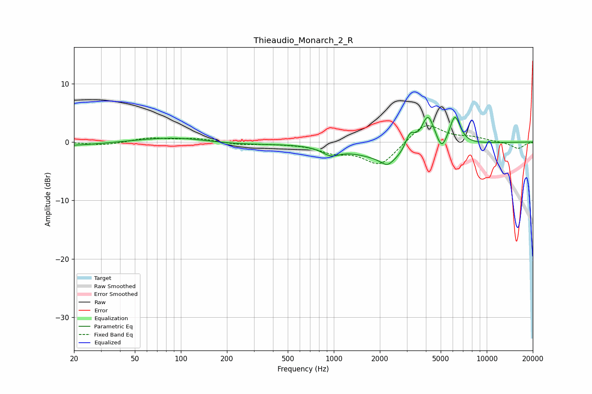

# Thieaudio_Monarch_2_R
See [usage instructions](https://github.com/jaakkopasanen/AutoEq#usage) for more options and info.

### Parametric EQs
Apply preamp of -4.3 dB when using parametric equalizer.

|   # | Type    |   Fc (Hz) |    Q |   Gain (dB) |
|-----|---------|-----------|------|-------------|
|   1 | Peaking |        50 | 0.47 |         1   |
|   2 | Peaking |        52 | 0.18 |        -1.4 |
|   3 | Peaking |       100 | 0.63 |         1.2 |
|   4 | Peaking |       954 | 2.49 |        -1.3 |
|   5 | Peaking |      2234 | 3.6  |        -1.3 |
|   6 | Peaking |      2565 | 0.65 |        -3.3 |
|   7 | Peaking |      3154 | 4.24 |         3.2 |
|   8 | Peaking |      4121 | 3.12 |         6.1 |
|   9 | Peaking |      5074 | 4.57 |        -2.2 |
|  10 | Peaking |      6192 | 3.84 |         5   |

### Fixed Band EQs
When using fixed band (also called graphic) equalizer, apply preamp of **-2.9 dB** (if available) and set gains manually with these parameters.

|   # | Type    |   Fc (Hz) |    Q |   Gain (dB) |
|-----|---------|-----------|------|-------------|
|   1 | Peaking |        31 | 1.41 |        -0.5 |
|   2 | Peaking |        62 | 1.41 |         0.7 |
|   3 | Peaking |       125 | 1.41 |         0.6 |
|   4 | Peaking |       250 | 1.41 |        -0.4 |
|   5 | Peaking |       500 | 1.41 |        -0.2 |
|   6 | Peaking |      1000 | 1.41 |        -1.5 |
|   7 | Peaking |      2000 | 1.41 |        -4   |
|   8 | Peaking |      4000 | 1.41 |         3.4 |
|   9 | Peaking |      8000 | 1.41 |         0.7 |
|  10 | Peaking |     16000 | 1.41 |        -1.1 |

### Graphs

