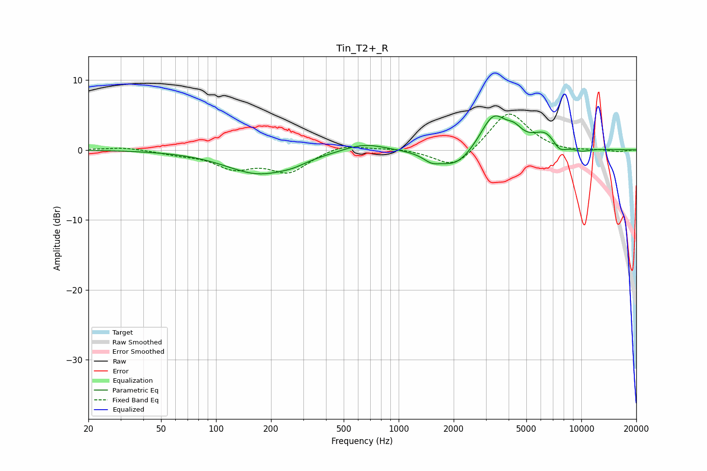

# Tin_T2+_R
See [usage instructions](https://github.com/jaakkopasanen/AutoEq#usage) for more options and info.

### Parametric EQs
Apply preamp of -5.0 dB when using parametric equalizer.

|   # | Type    |   Fc (Hz) |    Q |   Gain (dB) |
|-----|---------|-----------|------|-------------|
|   1 | Peaking |       172 | 0.78 |        -3.4 |
|   2 | Peaking |       265 | 1.94 |        -0.5 |
|   3 | Peaking |       646 | 1.23 |         1.2 |
|   4 | Peaking |      1509 | 3.26 |        -0.9 |
|   5 | Peaking |      2052 | 1.42 |        -2.8 |
|   6 | Peaking |      3299 | 1.92 |         5.1 |
|   7 | Peaking |      4293 | 3.24 |         1.4 |
|   8 | Peaking |      6416 | 1.92 |         2.4 |
|   9 | Peaking |      7564 | 3.3  |        -1.5 |
|  10 | Peaking |      9991 | 2.57 |        -0.5 |

### Fixed Band EQs
When using fixed band (also called graphic) equalizer, apply preamp of **-5.2 dB** (if available) and set gains manually with these parameters.

|   # | Type    |   Fc (Hz) |    Q |   Gain (dB) |
|-----|---------|-----------|------|-------------|
|   1 | Peaking |        31 | 1.41 |         0.4 |
|   2 | Peaking |        62 | 1.41 |        -0.5 |
|   3 | Peaking |       125 | 1.41 |        -2.4 |
|   4 | Peaking |       250 | 1.41 |        -3   |
|   5 | Peaking |       500 | 1.41 |         1   |
|   6 | Peaking |      1000 | 1.41 |         0.3 |
|   7 | Peaking |      2000 | 1.41 |        -2.8 |
|   8 | Peaking |      4000 | 1.41 |         5.6 |
|   9 | Peaking |      8000 | 1.41 |        -0.3 |
|  10 | Peaking |     16000 | 1.41 |        -0.3 |

### Graphs

