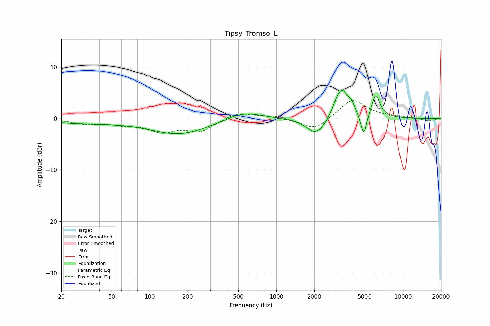

# Tipsy_Tromso_L
See [usage instructions](https://github.com/jaakkopasanen/AutoEq#usage) for more options and info.

### Parametric EQs
Apply preamp of -5.5 dB when using parametric equalizer.

|   # | Type    |   Fc (Hz) |    Q |   Gain (dB) |
|-----|---------|-----------|------|-------------|
|   1 | Peaking |        25 | 0.71 |        -0.7 |
|   2 | Peaking |        48 | 0.9  |        -0.3 |
|   3 | Peaking |       171 | 0.6  |        -3.1 |
|   4 | Peaking |       546 | 1.02 |         1.6 |
|   5 | Peaking |      2064 | 1.93 |        -3.3 |
|   6 | Peaking |      2961 | 5.26 |         0.8 |
|   7 | Peaking |      3295 | 2.82 |         5.5 |
|   8 | Peaking |      3932 | 4.92 |         1.4 |
|   9 | Peaking |      4913 | 5.88 |        -4.5 |
|  10 | Peaking |      6098 | 3.98 |         4.6 |

### Fixed Band EQs
When using fixed band (also called graphic) equalizer, apply preamp of **-3.6 dB** (if available) and set gains manually with these parameters.

|   # | Type    |   Fc (Hz) |    Q |   Gain (dB) |
|-----|---------|-----------|------|-------------|
|   1 | Peaking |        31 | 1.41 |        -0.9 |
|   2 | Peaking |        62 | 1.41 |        -0.9 |
|   3 | Peaking |       125 | 1.41 |        -2.3 |
|   4 | Peaking |       250 | 1.41 |        -2.4 |
|   5 | Peaking |       500 | 1.41 |         1.3 |
|   6 | Peaking |      1000 | 1.41 |         0.5 |
|   7 | Peaking |      2000 | 1.41 |        -2.4 |
|   8 | Peaking |      4000 | 1.41 |         3.8 |
|   9 | Peaking |      8000 | 1.41 |         0.2 |
|  10 | Peaking |     16000 | 1.41 |        -0.5 |

### Graphs

