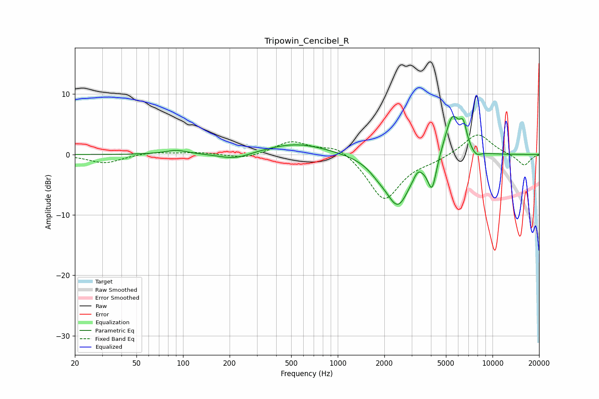

# Tripowin_Cencibel_R
See [usage instructions](https://github.com/jaakkopasanen/AutoEq#usage) for more options and info.

### Parametric EQs
Apply preamp of -6.4 dB when using parametric equalizer.

|   # | Type    |   Fc (Hz) |    Q |   Gain (dB) |
|-----|---------|-----------|------|-------------|
|   1 | Peaking |        90 | 1.94 |         0.7 |
|   2 | Peaking |       216 | 1.4  |        -1.1 |
|   3 | Peaking |       543 | 0.71 |         1.9 |
|   4 | Peaking |      1817 | 2.44 |        -0.9 |
|   5 | Peaking |      2444 | 1.71 |        -8.3 |
|   6 | Peaking |      3286 | 5.46 |         1.2 |
|   7 | Peaking |      4070 | 4.91 |        -5.4 |
|   8 | Peaking |      5498 | 2.77 |         7   |
|   9 | Peaking |      6471 | 5.93 |         3.2 |
|  10 | Peaking |      7820 | 4.13 |        -1   |

### Fixed Band EQs
When using fixed band (also called graphic) equalizer, apply preamp of **-3.3 dB** (if available) and set gains manually with these parameters.

|   # | Type    |   Fc (Hz) |    Q |   Gain (dB) |
|-----|---------|-----------|------|-------------|
|   1 | Peaking |        31 | 1.41 |        -1.4 |
|   2 | Peaking |        62 | 1.41 |         0.4 |
|   3 | Peaking |       125 | 1.41 |         0.3 |
|   4 | Peaking |       250 | 1.41 |        -0.8 |
|   5 | Peaking |       500 | 1.41 |         2.2 |
|   6 | Peaking |      1000 | 1.41 |         1.8 |
|   7 | Peaking |      2000 | 1.41 |        -7.6 |
|   8 | Peaking |      4000 | 1.41 |        -0.8 |
|   9 | Peaking |      8000 | 1.41 |         3.6 |
|  10 | Peaking |     16000 | 1.41 |        -1.9 |

### Graphs

