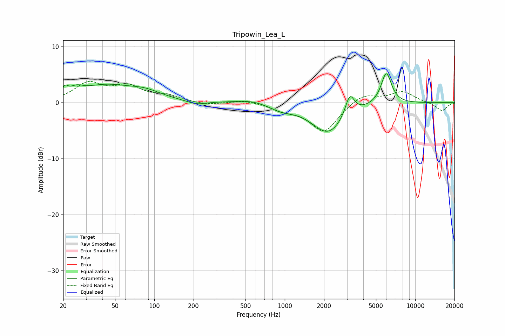

# Tripowin_Lea_L
See [usage instructions](https://github.com/jaakkopasanen/AutoEq#usage) for more options and info.

### Parametric EQs
Apply preamp of -5.3 dB when using parametric equalizer.

|   # | Type    |   Fc (Hz) |    Q |   Gain (dB) |
|-----|---------|-----------|------|-------------|
|   1 | Peaking |        21 | 5.98 |         1.3 |
|   2 | Peaking |        25 | 2.89 |         1.1 |
|   3 | Peaking |        42 | 0.7  |         2.8 |
|   4 | Peaking |        85 | 1.11 |         1.3 |
|   5 | Peaking |       211 | 2.03 |        -0.6 |
|   6 | Peaking |       558 | 1.17 |         0.7 |
|   7 | Peaking |       941 | 1.54 |        -1   |
|   8 | Peaking |      2155 | 1.12 |        -5.4 |
|   9 | Peaking |      3152 | 4.02 |         3.8 |
|  10 | Peaking |      6002 | 3.41 |         5.7 |

### Fixed Band EQs
When using fixed band (also called graphic) equalizer, apply preamp of **-3.9 dB** (if available) and set gains manually with these parameters.

|   # | Type    |   Fc (Hz) |    Q |   Gain (dB) |
|-----|---------|-----------|------|-------------|
|   1 | Peaking |        31 | 1.41 |         3.3 |
|   2 | Peaking |        62 | 1.41 |         2.6 |
|   3 | Peaking |       125 | 1.41 |         1.1 |
|   4 | Peaking |       250 | 1.41 |        -0.5 |
|   5 | Peaking |       500 | 1.41 |         0.5 |
|   6 | Peaking |      1000 | 1.41 |        -1.1 |
|   7 | Peaking |      2000 | 1.41 |        -5.2 |
|   8 | Peaking |      4000 | 1.41 |         1.7 |
|   9 | Peaking |      8000 | 1.41 |         1.9 |
|  10 | Peaking |     16000 | 1.41 |        -1.5 |

### Graphs

