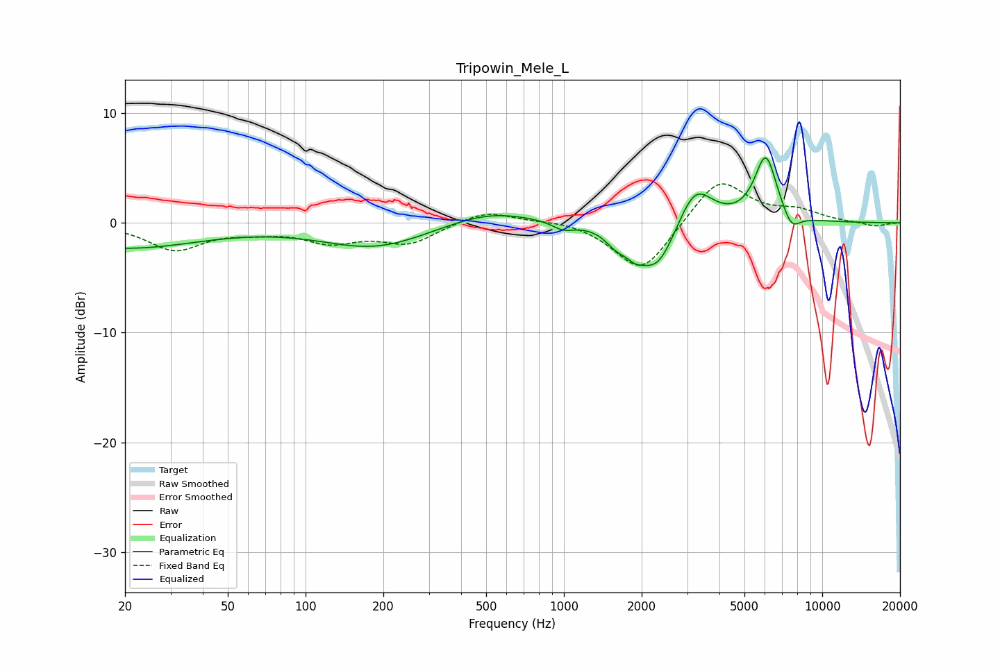

# Tripowin_Mele_L
See [usage instructions](https://github.com/jaakkopasanen/AutoEq#usage) for more options and info.

### Parametric EQs
Apply preamp of -6.0 dB when using parametric equalizer.

|   # | Type    |   Fc (Hz) |    Q |   Gain (dB) |
|-----|---------|-----------|------|-------------|
|   1 | Peaking |        20 | 0.49 |        -2.3 |
|   2 | Peaking |       186 | 0.68 |        -2.3 |
|   3 | Peaking |       513 | 0.83 |         1.3 |
|   4 | Peaking |       995 | 3.36 |        -0.7 |
|   5 | Peaking |      1590 | 3.36 |        -1.2 |
|   6 | Peaking |      1882 | 3.61 |        -1.2 |
|   7 | Peaking |      2299 | 1.93 |        -4.4 |
|   8 | Peaking |      3215 | 2.09 |         3.8 |
|   9 | Peaking |      6046 | 3.15 |         6   |
|  10 | Peaking |      7595 | 3.94 |        -1.6 |

### Fixed Band EQs
When using fixed band (also called graphic) equalizer, apply preamp of **-3.6 dB** (if available) and set gains manually with these parameters.

|   # | Type    |   Fc (Hz) |    Q |   Gain (dB) |
|-----|---------|-----------|------|-------------|
|   1 | Peaking |        31 | 1.41 |        -2.4 |
|   2 | Peaking |        62 | 1.41 |        -0.5 |
|   3 | Peaking |       125 | 1.41 |        -1.6 |
|   4 | Peaking |       250 | 1.41 |        -1.8 |
|   5 | Peaking |       500 | 1.41 |         1.2 |
|   6 | Peaking |      1000 | 1.41 |         0.3 |
|   7 | Peaking |      2000 | 1.41 |        -4.7 |
|   8 | Peaking |      4000 | 1.41 |         4.2 |
|   9 | Peaking |      8000 | 1.41 |         1   |
|  10 | Peaking |     16000 | 1.41 |        -0.4 |

### Graphs

