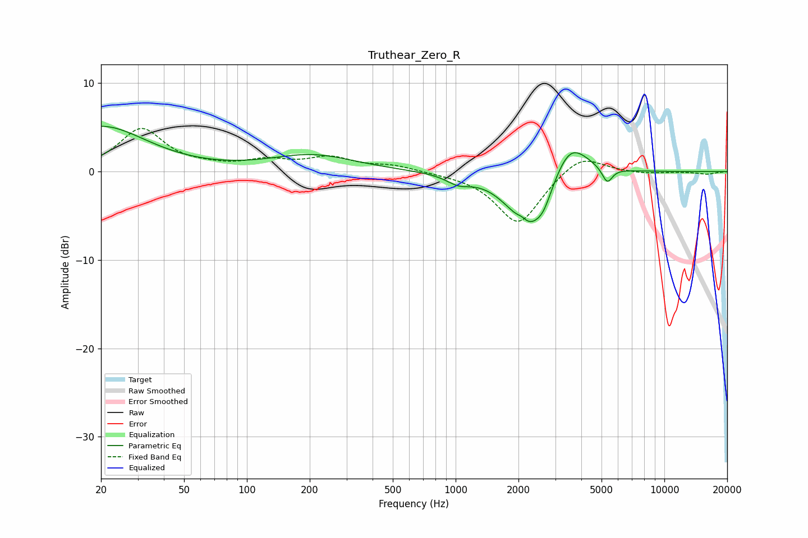

# Truthear_Zero_R
See [usage instructions](https://github.com/jaakkopasanen/AutoEq#usage) for more options and info.

### Parametric EQs
Apply preamp of -5.2 dB when using parametric equalizer.

|   # | Type    |   Fc (Hz) |    Q |   Gain (dB) |
|-----|---------|-----------|------|-------------|
|   1 | Peaking |        20 | 0.65 |         5.1 |
|   2 | Peaking |       206 | 0.7  |         1.8 |
|   3 | Peaking |      1032 | 2.42 |        -1   |
|   4 | Peaking |      2064 | 1.35 |        -1.5 |
|   5 | Peaking |      2077 | 5.71 |         0.6 |
|   6 | Peaking |      2307 | 1.55 |        -5.9 |
|   7 | Peaking |      2427 | 2.34 |         0.6 |
|   8 | Peaking |      2644 | 3.88 |        -1.2 |
|   9 | Peaking |      3521 | 1.63 |         4.5 |
|  10 | Peaking |      5326 | 5.7  |        -1.8 |

### Fixed Band EQs
When using fixed band (also called graphic) equalizer, apply preamp of **-5.0 dB** (if available) and set gains manually with these parameters.

|   # | Type    |   Fc (Hz) |    Q |   Gain (dB) |
|-----|---------|-----------|------|-------------|
|   1 | Peaking |        31 | 1.41 |         4.8 |
|   2 | Peaking |        62 | 1.41 |         0.3 |
|   3 | Peaking |       125 | 1.41 |         1.1 |
|   4 | Peaking |       250 | 1.41 |         1.5 |
|   5 | Peaking |       500 | 1.41 |         0.6 |
|   6 | Peaking |      1000 | 1.41 |        -0.1 |
|   7 | Peaking |      2000 | 1.41 |        -6   |
|   8 | Peaking |      4000 | 1.41 |         2.2 |
|   9 | Peaking |      8000 | 1.41 |        -0.2 |
|  10 | Peaking |     16000 | 1.41 |        -0.3 |

### Graphs

