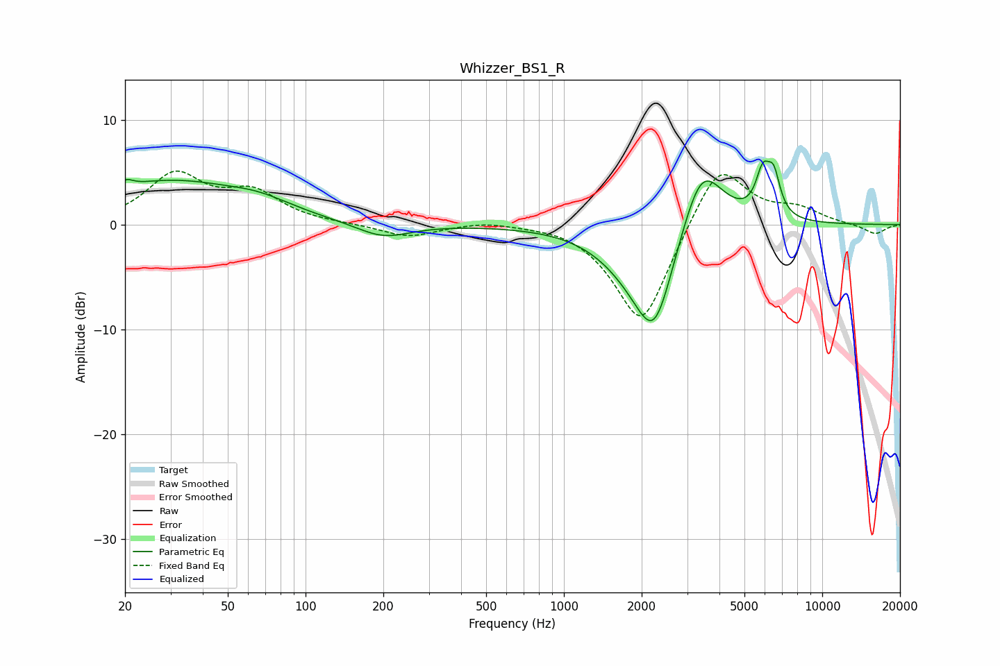

# Whizzer_BS1_R
See [usage instructions](https://github.com/jaakkopasanen/AutoEq#usage) for more options and info.

### Parametric EQs
Apply preamp of -6.2 dB when using parametric equalizer.

|   # | Type    |   Fc (Hz) |    Q |   Gain (dB) |
|-----|---------|-----------|------|-------------|
|   1 | Peaking |        20 | 5.99 |        -2.5 |
|   2 | Peaking |        20 | 5.89 |         3.2 |
|   3 | Peaking |        29 | 0.49 |         4   |
|   4 | Peaking |        66 | 1.13 |         1   |
|   5 | Peaking |       200 | 1.35 |        -1.4 |
|   6 | Peaking |      1846 | 1.07 |        -2.4 |
|   7 | Peaking |      2241 | 1.73 |        -9.4 |
|   8 | Peaking |      3401 | 1.65 |         7.4 |
|   9 | Peaking |      5890 | 5.03 |         3.8 |
|  10 | Peaking |      6492 | 5.45 |         3.5 |

### Fixed Band EQs
When using fixed band (also called graphic) equalizer, apply preamp of **-5.2 dB** (if available) and set gains manually with these parameters.

|   # | Type    |   Fc (Hz) |    Q |   Gain (dB) |
|-----|---------|-----------|------|-------------|
|   1 | Peaking |        31 | 1.41 |         4.6 |
|   2 | Peaking |        62 | 1.41 |         2.8 |
|   3 | Peaking |       125 | 1.41 |         0   |
|   4 | Peaking |       250 | 1.41 |        -1.2 |
|   5 | Peaking |       500 | 1.41 |         0.4 |
|   6 | Peaking |      1000 | 1.41 |         0.3 |
|   7 | Peaking |      2000 | 1.41 |        -9.9 |
|   8 | Peaking |      4000 | 1.41 |         6.4 |
|   9 | Peaking |      8000 | 1.41 |         1.3 |
|  10 | Peaking |     16000 | 1.41 |        -0.9 |

### Graphs

