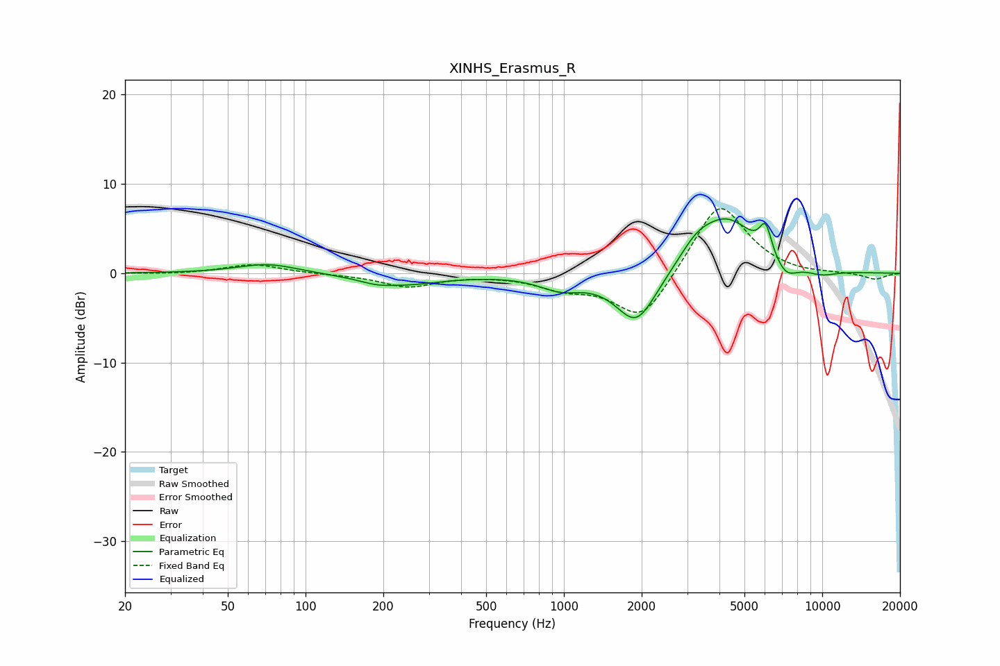

# XINHS_Erasmus_R
See [usage instructions](https://github.com/jaakkopasanen/AutoEq#usage) for more options and info.

### Parametric EQs
Apply preamp of -6.2 dB when using parametric equalizer.

|   # | Type    |   Fc (Hz) |    Q |   Gain (dB) |
|-----|---------|-----------|------|-------------|
|   1 | Peaking |        71 | 1.2  |         1.1 |
|   2 | Peaking |       187 | 2.36 |        -0.4 |
|   3 | Peaking |       238 | 0.91 |        -1.2 |
|   4 | Peaking |       970 | 1.68 |        -1.5 |
|   5 | Peaking |      1909 | 1.75 |        -5.9 |
|   6 | Peaking |      3257 | 2.13 |         1.9 |
|   7 | Peaking |      4282 | 1.22 |         5.9 |
|   8 | Peaking |      6036 | 5.95 |         3.2 |
|   9 | Peaking |      7230 | 3.02 |        -1.8 |
|  10 | Peaking |      9939 | 2.08 |        -0.6 |

### Fixed Band EQs
When using fixed band (also called graphic) equalizer, apply preamp of **-7.3 dB** (if available) and set gains manually with these parameters.

|   # | Type    |   Fc (Hz) |    Q |   Gain (dB) |
|-----|---------|-----------|------|-------------|
|   1 | Peaking |        31 | 1.41 |        -0.1 |
|   2 | Peaking |        62 | 1.41 |         1   |
|   3 | Peaking |       125 | 1.41 |        -0.1 |
|   4 | Peaking |       250 | 1.41 |        -1.5 |
|   5 | Peaking |       500 | 1.41 |        -0.1 |
|   6 | Peaking |      1000 | 1.41 |        -1.4 |
|   7 | Peaking |      2000 | 1.41 |        -5.5 |
|   8 | Peaking |      4000 | 1.41 |         8.3 |
|   9 | Peaking |      8000 | 1.41 |        -0.2 |
|  10 | Peaking |     16000 | 1.41 |        -0.7 |

### Graphs

