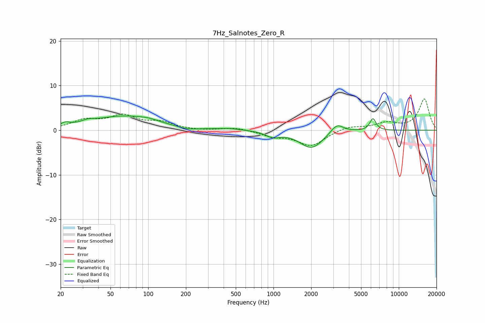

# 7Hz_Salnotes_Zero_R
See [usage instructions](https://github.com/jaakkopasanen/AutoEq#usage) for more options and info.

### Parametric EQs
Apply preamp of -3.3 dB when using parametric equalizer.

|   # | Type    |   Fc (Hz) |    Q |   Gain (dB) |
|-----|---------|-----------|------|-------------|
|   1 | Peaking |        22 | 3.97 |         0.8 |
|   2 | Peaking |        33 | 2.76 |         0.6 |
|   3 | Peaking |        63 | 0.58 |         3.1 |
|   4 | Peaking |       101 | 1.98 |         0.5 |
|   5 | Peaking |       205 | 2.16 |        -0.5 |
|   6 | Peaking |       452 | 1.6  |         0.3 |
|   7 | Peaking |       991 | 2.65 |        -1.2 |
|   8 | Peaking |      2012 | 1.49 |        -4   |
|   9 | Peaking |      3206 | 2.74 |         2.2 |
|  10 | Peaking |      6220 | 5.64 |         2.7 |

### Fixed Band EQs
When using fixed band (also called graphic) equalizer, apply preamp of **-7.1 dB** (if available) and set gains manually with these parameters.

|   # | Type    |   Fc (Hz) |    Q |   Gain (dB) |
|-----|---------|-----------|------|-------------|
|   1 | Peaking |        31 | 1.41 |         2   |
|   2 | Peaking |        62 | 1.41 |         3   |
|   3 | Peaking |       125 | 1.41 |         1.6 |
|   4 | Peaking |       250 | 1.41 |        -0.1 |
|   5 | Peaking |       500 | 1.41 |         0.6 |
|   6 | Peaking |      1000 | 1.41 |        -1.2 |
|   7 | Peaking |      2000 | 1.41 |        -3.4 |
|   8 | Peaking |      4000 | 1.41 |         0.9 |
|   9 | Peaking |      8000 | 1.41 |         1.5 |
|  10 | Peaking |     16000 | 1.41 |         7   |

### Graphs

