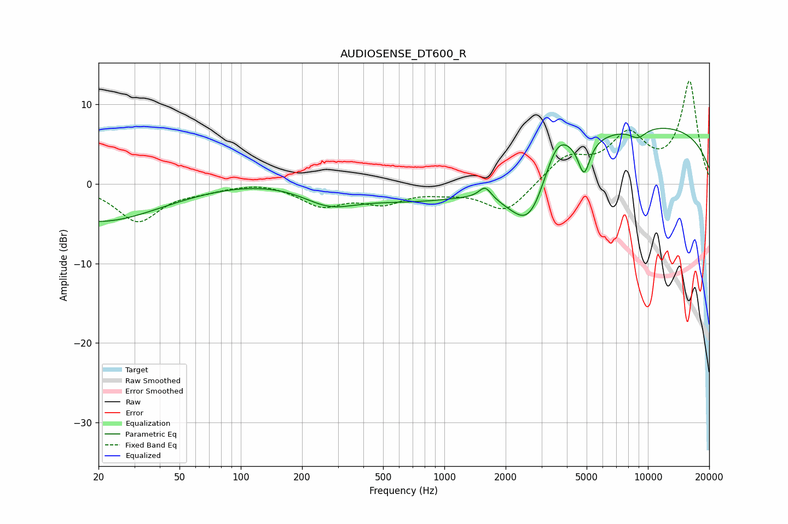

# AUDIOSENSE_DT600_R
See [usage instructions](https://github.com/jaakkopasanen/AutoEq#usage) for more options and info.

### Parametric EQs
Apply preamp of -7.1 dB when using parametric equalizer.

|   # | Type    |   Fc (Hz) |    Q |   Gain (dB) |
|-----|---------|-----------|------|-------------|
|   1 | Peaking |        20 | 0.46 |        -4.8 |
|   2 | Peaking |       210 | 0.38 |         1.2 |
|   3 | Peaking |       270 | 1.09 |        -2.2 |
|   4 | Peaking |       855 | 0.31 |        -3.1 |
|   5 | Peaking |      1587 | 4.68 |         1.6 |
|   6 | Peaking |      2636 | 1.25 |        -9.1 |
|   7 | Peaking |      3559 | 1.92 |         5.1 |
|   8 | Peaking |      4855 | 4.82 |        -4.3 |
|   9 | Peaking |      8628 | 0.18 |         7.6 |
|  10 | Peaking |      8925 | 3.01 |        -1.3 |

### Fixed Band EQs
When using fixed band (also called graphic) equalizer, apply preamp of **-13.0 dB** (if available) and set gains manually with these parameters.

|   # | Type    |   Fc (Hz) |    Q |   Gain (dB) |
|-----|---------|-----------|------|-------------|
|   1 | Peaking |        31 | 1.41 |        -4.6 |
|   2 | Peaking |        62 | 1.41 |        -0.6 |
|   3 | Peaking |       125 | 1.41 |         0.4 |
|   4 | Peaking |       250 | 1.41 |        -2.5 |
|   5 | Peaking |       500 | 1.41 |        -2.1 |
|   6 | Peaking |      1000 | 1.41 |        -0.7 |
|   7 | Peaking |      2000 | 1.41 |        -3.6 |
|   8 | Peaking |      4000 | 1.41 |         3.2 |
|   9 | Peaking |      8000 | 1.41 |         5.6 |
|  10 | Peaking |     16000 | 1.41 |        12.7 |

### Graphs

