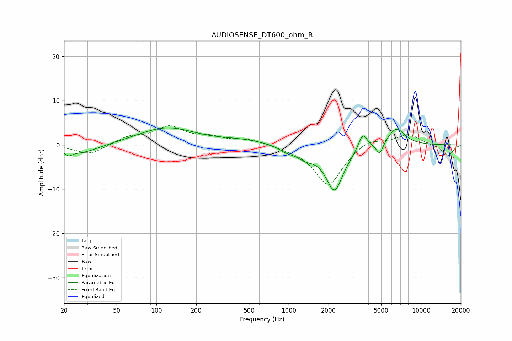

# AUDIOSENSE_DT600_ohm_R
See [usage instructions](https://github.com/jaakkopasanen/AutoEq#usage) for more options and info.

### Parametric EQs
Apply preamp of -3.9 dB when using parametric equalizer.

|   # | Type    |   Fc (Hz) |    Q |   Gain (dB) |
|-----|---------|-----------|------|-------------|
|   1 | Peaking |        22 | 5.46 |        -1   |
|   2 | Peaking |        27 | 1.05 |        -2.1 |
|   3 | Peaking |       119 | 0.66 |         3.9 |
|   4 | Peaking |       451 | 0.82 |         0.9 |
|   5 | Peaking |       960 | 2.76 |        -1   |
|   6 | Peaking |      1329 | 2.06 |        -2   |
|   7 | Peaking |      2218 | 2.07 |       -10.2 |
|   8 | Peaking |      3632 | 4.3  |         3.8 |
|   9 | Peaking |      4874 | 5.34 |        -2.8 |
|  10 | Peaking |      6502 | 2.08 |         4   |

### Fixed Band EQs
When using fixed band (also called graphic) equalizer, apply preamp of **-4.4 dB** (if available) and set gains manually with these parameters.

|   # | Type    |   Fc (Hz) |    Q |   Gain (dB) |
|-----|---------|-----------|------|-------------|
|   1 | Peaking |        31 | 1.41 |        -2.3 |
|   2 | Peaking |        62 | 1.41 |         1.7 |
|   3 | Peaking |       125 | 1.41 |         3.8 |
|   4 | Peaking |       250 | 1.41 |         1.5 |
|   5 | Peaking |       500 | 1.41 |         1.2 |
|   6 | Peaking |      1000 | 1.41 |        -0.3 |
|   7 | Peaking |      2000 | 1.41 |        -9.3 |
|   8 | Peaking |      4000 | 1.41 |         1.8 |
|   9 | Peaking |      8000 | 1.41 |         2.5 |
|  10 | Peaking |     16000 | 1.41 |        -2.5 |

### Graphs

