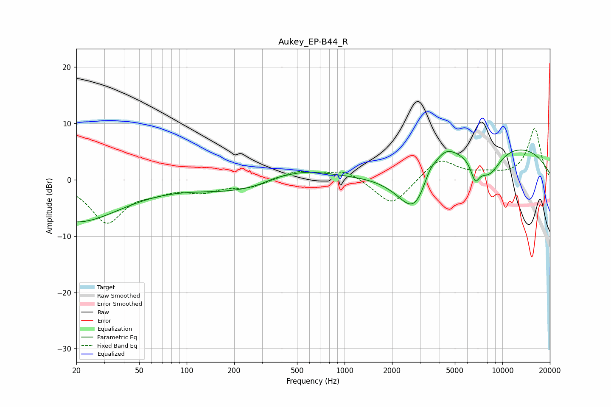

# Aukey_EP-B44_R
See [usage instructions](https://github.com/jaakkopasanen/AutoEq#usage) for more options and info.

### Parametric EQs
Apply preamp of -5.4 dB when using parametric equalizer.

|   # | Type    |   Fc (Hz) |    Q |   Gain (dB) |
|-----|---------|-----------|------|-------------|
|   1 | Peaking |        20 | 0.49 |        -7.4 |
|   2 | Peaking |       237 | 0.48 |        -2.4 |
|   3 | Peaking |       358 | 2.63 |         0.3 |
|   4 | Peaking |       506 | 0.69 |         2.6 |
|   5 | Peaking |      2782 | 1.21 |        -9.4 |
|   6 | Peaking |      3445 | 3.74 |         1.8 |
|   7 | Peaking |      4252 | 1.68 |         3.7 |
|   8 | Peaking |      6725 | 4.93 |        -3.3 |
|   9 | Peaking |      8194 | 1.62 |        -5   |
|  10 | Peaking |      8887 | 0.25 |         6.8 |

### Fixed Band EQs
When using fixed band (also called graphic) equalizer, apply preamp of **-9.2 dB** (if available) and set gains manually with these parameters.

|   # | Type    |   Fc (Hz) |    Q |   Gain (dB) |
|-----|---------|-----------|------|-------------|
|   1 | Peaking |        31 | 1.41 |        -7.4 |
|   2 | Peaking |        62 | 1.41 |        -1.4 |
|   3 | Peaking |       125 | 1.41 |        -1.8 |
|   4 | Peaking |       250 | 1.41 |        -1.2 |
|   5 | Peaking |       500 | 1.41 |         1.5 |
|   6 | Peaking |      1000 | 1.41 |         1.8 |
|   7 | Peaking |      2000 | 1.41 |        -4.8 |
|   8 | Peaking |      4000 | 1.41 |         3.8 |
|   9 | Peaking |      8000 | 1.41 |         0.8 |
|  10 | Peaking |     16000 | 1.41 |         9.1 |

### Graphs

