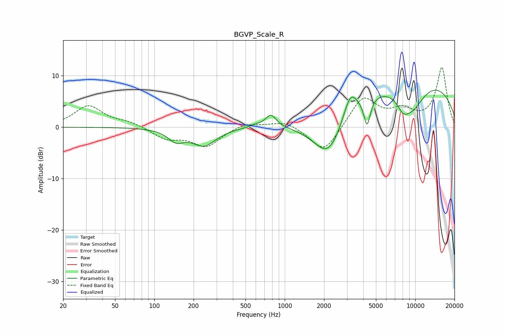

# BGVP_Scale_R
See [usage instructions](https://github.com/jaakkopasanen/AutoEq#usage) for more options and info.

### Parametric EQs
Apply preamp of -7.3 dB when using parametric equalizer.

|   # | Type    |   Fc (Hz) |    Q |   Gain (dB) |
|-----|---------|-----------|------|-------------|
|   1 | Peaking |       147 | 2.3  |        -2.2 |
|   2 | Peaking |       240 | 1.53 |        -3.4 |
|   3 | Peaking |       594 | 2.96 |         0.4 |
|   4 | Peaking |       783 | 3.47 |         2.4 |
|   5 | Peaking |      2171 | 1.07 |        -9.8 |
|   6 | Peaking |      3180 | 2.68 |         4.8 |
|   7 | Peaking |      4271 | 5.63 |        -5.4 |
|   8 | Peaking |      8050 | 3.03 |        -2.1 |
|   9 | Peaking |      8818 | 0.21 |        10.2 |
|  10 | Peaking |      9376 | 1.19 |        -5.9 |

### Fixed Band EQs
When using fixed band (also called graphic) equalizer, apply preamp of **-11.7 dB** (if available) and set gains manually with these parameters.

|   # | Type    |   Fc (Hz) |    Q |   Gain (dB) |
|-----|---------|-----------|------|-------------|
|   1 | Peaking |        31 | 1.41 |         4.1 |
|   2 | Peaking |        62 | 1.41 |         0.9 |
|   3 | Peaking |       125 | 1.41 |        -2.1 |
|   4 | Peaking |       250 | 1.41 |        -3.6 |
|   5 | Peaking |       500 | 1.41 |         0.9 |
|   6 | Peaking |      1000 | 1.41 |         1.3 |
|   7 | Peaking |      2000 | 1.41 |        -5.2 |
|   8 | Peaking |      4000 | 1.41 |         5.9 |
|   9 | Peaking |      8000 | 1.41 |         2.7 |
|  10 | Peaking |     16000 | 1.41 |        11.5 |

### Graphs

