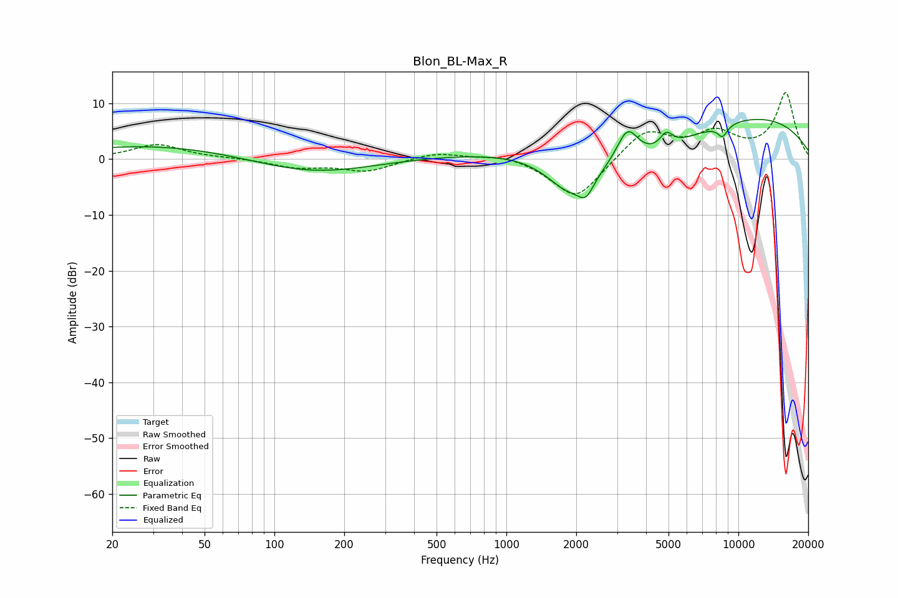

# Blon_BL-Max_R
See [usage instructions](https://github.com/jaakkopasanen/AutoEq#usage) for more options and info.

### Parametric EQs
Apply preamp of -7.2 dB when using parametric equalizer.

|   # | Type    |   Fc (Hz) |    Q |   Gain (dB) |
|-----|---------|-----------|------|-------------|
|   1 | Peaking |        75 | 0.18 |         3.6 |
|   2 | Peaking |       148 | 0.46 |        -5.4 |
|   3 | Peaking |      1844 | 1.44 |        -5.9 |
|   4 | Peaking |      2201 | 4.11 |        -3.2 |
|   5 | Peaking |      3326 | 2.72 |         7.2 |
|   6 | Peaking |      3424 | 0.54 |        -9.8 |
|   7 | Peaking |      4892 | 4.91 |         2.6 |
|   8 | Peaking |      6626 | 0.18 |         9.9 |
|   9 | Peaking |      8434 | 5.43 |         2   |
|  10 | Peaking |      8495 | 5.54 |        -4.1 |

### Fixed Band EQs
When using fixed band (also called graphic) equalizer, apply preamp of **-12.0 dB** (if available) and set gains manually with these parameters.

|   # | Type    |   Fc (Hz) |    Q |   Gain (dB) |
|-----|---------|-----------|------|-------------|
|   1 | Peaking |        31 | 1.41 |         2.6 |
|   2 | Peaking |        62 | 1.41 |         0.2 |
|   3 | Peaking |       125 | 1.41 |        -1.4 |
|   4 | Peaking |       250 | 1.41 |        -2.1 |
|   5 | Peaking |       500 | 1.41 |         1.3 |
|   6 | Peaking |      1000 | 1.41 |         1   |
|   7 | Peaking |      2000 | 1.41 |        -7.5 |
|   8 | Peaking |      4000 | 1.41 |         5.3 |
|   9 | Peaking |      8000 | 1.41 |         4.2 |
|  10 | Peaking |     16000 | 1.41 |        11.8 |

### Graphs

