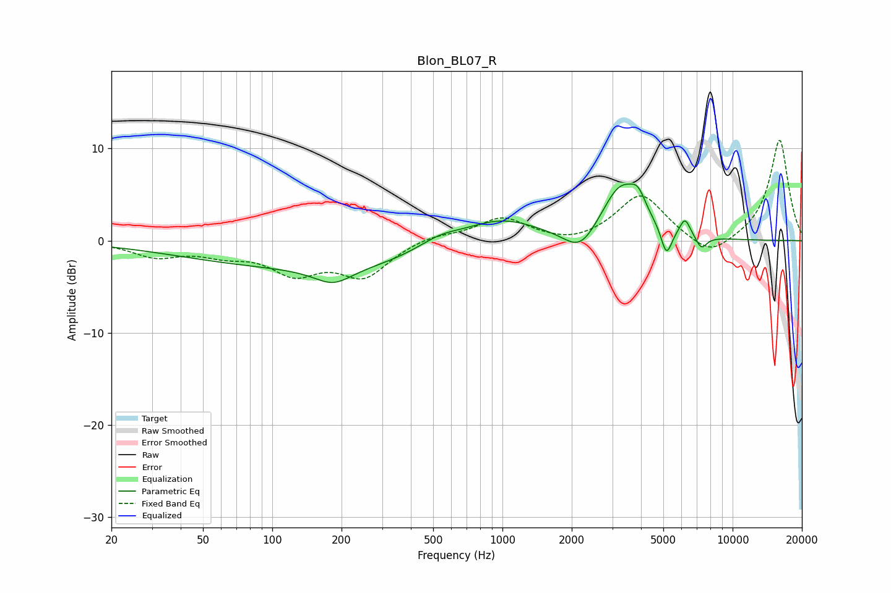

# Blon_BL07_R
See [usage instructions](https://github.com/jaakkopasanen/AutoEq#usage) for more options and info.

### Parametric EQs
Apply preamp of -6.2 dB when using parametric equalizer.

|   # | Type    |   Fc (Hz) |    Q |   Gain (dB) |
|-----|---------|-----------|------|-------------|
|   1 | Peaking |       184 | 1.68 |        -1.8 |
|   2 | Peaking |       204 | 0.18 |        -3   |
|   3 | Peaking |       531 | 1.32 |         1.5 |
|   4 | Peaking |       965 | 0.79 |         3.5 |
|   5 | Peaking |      2189 | 1.94 |        -2.8 |
|   6 | Peaking |      3272 | 1.61 |         6   |
|   7 | Peaking |      3890 | 4.41 |         1.8 |
|   8 | Peaking |      5160 | 5.92 |        -3.1 |
|   9 | Peaking |      6210 | 5.97 |         1.9 |
|  10 | Peaking |      7316 | 5.59 |        -1.4 |

### Fixed Band EQs
When using fixed band (also called graphic) equalizer, apply preamp of **-11.0 dB** (if available) and set gains manually with these parameters.

|   # | Type    |   Fc (Hz) |    Q |   Gain (dB) |
|-----|---------|-----------|------|-------------|
|   1 | Peaking |        31 | 1.41 |        -1.6 |
|   2 | Peaking |        62 | 1.41 |        -1.2 |
|   3 | Peaking |       125 | 1.41 |        -3.2 |
|   4 | Peaking |       250 | 1.41 |        -3.7 |
|   5 | Peaking |       500 | 1.41 |         0.7 |
|   6 | Peaking |      1000 | 1.41 |         2.4 |
|   7 | Peaking |      2000 | 1.41 |        -0.6 |
|   8 | Peaking |      4000 | 1.41 |         5   |
|   9 | Peaking |      8000 | 1.41 |        -2.1 |
|  10 | Peaking |     16000 | 1.41 |        11   |

### Graphs

