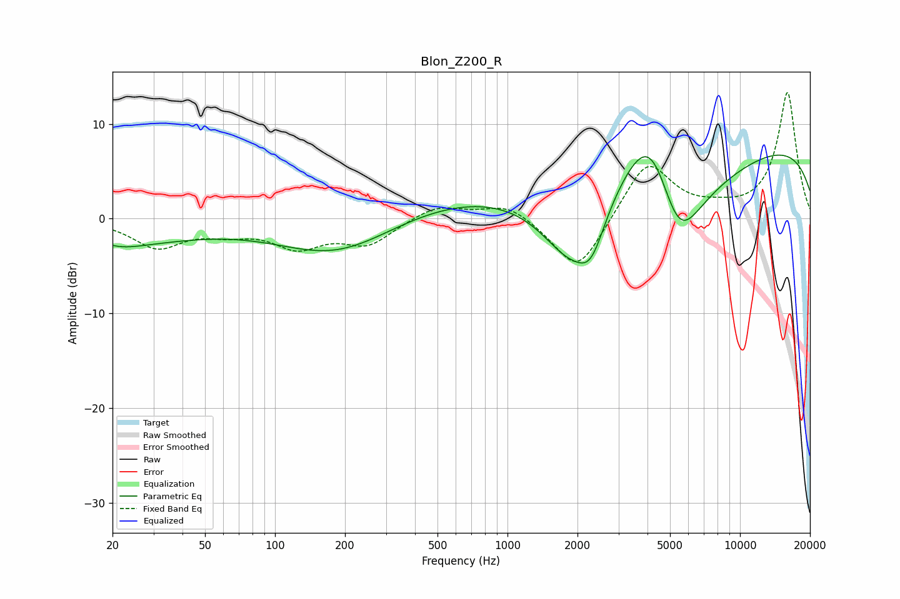

# Blon_Z200_R
See [usage instructions](https://github.com/jaakkopasanen/AutoEq#usage) for more options and info.

### Parametric EQs
Apply preamp of -6.8 dB when using parametric equalizer.

|   # | Type    |   Fc (Hz) |    Q |   Gain (dB) |
|-----|---------|-----------|------|-------------|
|   1 | Peaking |        21 | 1.36 |        -1.1 |
|   2 | Peaking |        27 | 0.6  |        -1.8 |
|   3 | Peaking |        53 | 0.9  |        -0.1 |
|   4 | Peaking |       188 | 0.55 |        -4.4 |
|   5 | Peaking |       688 | 0.31 |         2.7 |
|   6 | Peaking |      1850 | 1.03 |        -7.7 |
|   7 | Peaking |      2290 | 2.26 |        -4.4 |
|   8 | Peaking |      4173 | 0.95 |        13.2 |
|   9 | Peaking |      5401 | 0.88 |       -16.6 |
|  10 | Peaking |     10000 | 0.18 |         8.6 |

### Fixed Band EQs
When using fixed band (also called graphic) equalizer, apply preamp of **-13.4 dB** (if available) and set gains manually with these parameters.

|   # | Type    |   Fc (Hz) |    Q |   Gain (dB) |
|-----|---------|-----------|------|-------------|
|   1 | Peaking |        31 | 1.41 |        -2.9 |
|   2 | Peaking |        62 | 1.41 |        -1.1 |
|   3 | Peaking |       125 | 1.41 |        -2.7 |
|   4 | Peaking |       250 | 1.41 |        -2.6 |
|   5 | Peaking |       500 | 1.41 |         1.5 |
|   6 | Peaking |      1000 | 1.41 |         1.7 |
|   7 | Peaking |      2000 | 1.41 |        -6   |
|   8 | Peaking |      4000 | 1.41 |         6.2 |
|   9 | Peaking |      8000 | 1.41 |         0.6 |
|  10 | Peaking |     16000 | 1.41 |        13.3 |

### Graphs

