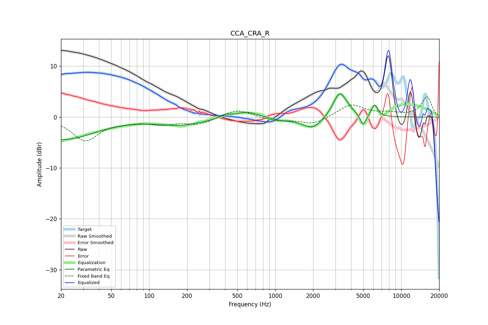

# CCA_CRA_R
See [usage instructions](https://github.com/jaakkopasanen/AutoEq#usage) for more options and info.

### Parametric EQs
Apply preamp of -4.7 dB when using parametric equalizer.

|   # | Type    |   Fc (Hz) |    Q |   Gain (dB) |
|-----|---------|-----------|------|-------------|
|   1 | Peaking |        20 | 0.53 |        -4.4 |
|   2 | Peaking |       178 | 0.76 |        -1.5 |
|   3 | Peaking |       401 | 3.38 |         0.7 |
|   4 | Peaking |       598 | 1.59 |         1.3 |
|   5 | Peaking |      1108 | 1.49 |        -0.6 |
|   6 | Peaking |      1978 | 1.82 |        -2.4 |
|   7 | Peaking |      3240 | 2.75 |         4.4 |
|   8 | Peaking |      3549 | 2.04 |         0.9 |
|   9 | Peaking |      4982 | 5.98 |        -2.3 |
|  10 | Peaking |      6145 | 5.83 |         2.3 |

### Fixed Band EQs
When using fixed band (also called graphic) equalizer, apply preamp of **-4.1 dB** (if available) and set gains manually with these parameters.

|   # | Type    |   Fc (Hz) |    Q |   Gain (dB) |
|-----|---------|-----------|------|-------------|
|   1 | Peaking |        31 | 1.41 |        -4.5 |
|   2 | Peaking |        62 | 1.41 |        -0.6 |
|   3 | Peaking |       125 | 1.41 |        -1.2 |
|   4 | Peaking |       250 | 1.41 |        -1.3 |
|   5 | Peaking |       500 | 1.41 |         1.6 |
|   6 | Peaking |      1000 | 1.41 |        -0.7 |
|   7 | Peaking |      2000 | 1.41 |        -1.5 |
|   8 | Peaking |      4000 | 1.41 |         2.5 |
|   9 | Peaking |      8000 | 1.41 |         0.7 |
|  10 | Peaking |     16000 | 1.41 |         4   |

### Graphs

