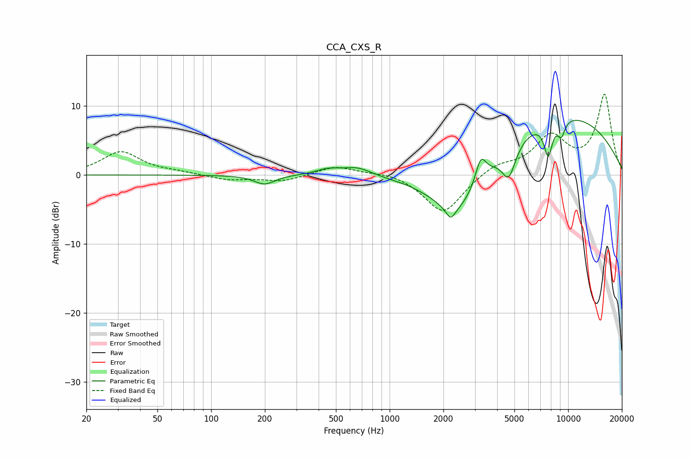

# CCA_CXS_R
See [usage instructions](https://github.com/jaakkopasanen/AutoEq#usage) for more options and info.

### Parametric EQs
Apply preamp of -8.0 dB when using parametric equalizer.

|   # | Type    |   Fc (Hz) |    Q |   Gain (dB) |
|-----|---------|-----------|------|-------------|
|   1 | Peaking |       199 | 2.41 |        -1.4 |
|   2 | Peaking |       452 | 2.03 |         0.8 |
|   3 | Peaking |       661 | 1.8  |         1.2 |
|   4 | Peaking |      2196 | 5.68 |        -1.6 |
|   5 | Peaking |      2400 | 0.93 |        -8.3 |
|   6 | Peaking |      3240 | 4.75 |         3.6 |
|   7 | Peaking |      4650 | 3.55 |        -4.6 |
|   8 | Peaking |      7729 | 5.63 |        -4.9 |
|   9 | Peaking |      8733 | 0.31 |         9.1 |
|  10 | Peaking |      9155 | 6    |        -2.3 |

### Fixed Band EQs
When using fixed band (also called graphic) equalizer, apply preamp of **-11.8 dB** (if available) and set gains manually with these parameters.

|   # | Type    |   Fc (Hz) |    Q |   Gain (dB) |
|-----|---------|-----------|------|-------------|
|   1 | Peaking |        31 | 1.41 |         3.4 |
|   2 | Peaking |        62 | 1.41 |         0.3 |
|   3 | Peaking |       125 | 1.41 |        -0.7 |
|   4 | Peaking |       250 | 1.41 |        -0.9 |
|   5 | Peaking |       500 | 1.41 |         1.3 |
|   6 | Peaking |      1000 | 1.41 |         0.5 |
|   7 | Peaking |      2000 | 1.41 |        -5.7 |
|   8 | Peaking |      4000 | 1.41 |         1.5 |
|   9 | Peaking |      8000 | 1.41 |         5.3 |
|  10 | Peaking |     16000 | 1.41 |        11.5 |

### Graphs

