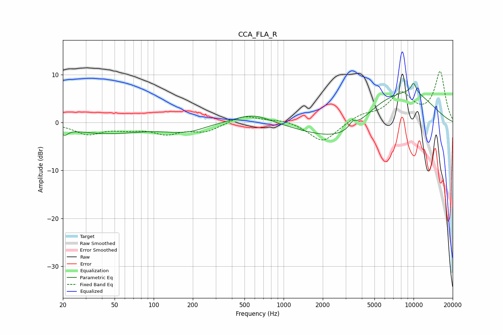

# CCA_FLA_R
See [usage instructions](https://github.com/jaakkopasanen/AutoEq#usage) for more options and info.

### Parametric EQs
Apply preamp of -8.3 dB when using parametric equalizer.

|   # | Type    |   Fc (Hz) |    Q |   Gain (dB) |
|-----|---------|-----------|------|-------------|
|   1 | Peaking |        21 | 5.37 |        -1.3 |
|   2 | Peaking |        45 | 0.48 |        -2.2 |
|   3 | Peaking |       136 | 1.32 |        -0.5 |
|   4 | Peaking |       190 | 1.15 |        -1.3 |
|   5 | Peaking |       579 | 1.03 |         2.1 |
|   6 | Peaking |      3220 | 0.51 |        -5.8 |
|   7 | Peaking |      3405 | 5.34 |         1.2 |
|   8 | Peaking |      5390 | 0.65 |         5.4 |
|   9 | Peaking |      9961 | 0.62 |         5   |
|  10 | Peaking |      9995 | 5.76 |         2.1 |

### Fixed Band EQs
When using fixed band (also called graphic) equalizer, apply preamp of **-10.8 dB** (if available) and set gains manually with these parameters.

|   # | Type    |   Fc (Hz) |    Q |   Gain (dB) |
|-----|---------|-----------|------|-------------|
|   1 | Peaking |        31 | 1.41 |        -2.3 |
|   2 | Peaking |        62 | 1.41 |        -1   |
|   3 | Peaking |       125 | 1.41 |        -2.1 |
|   4 | Peaking |       250 | 1.41 |        -1.8 |
|   5 | Peaking |       500 | 1.41 |         1.6 |
|   6 | Peaking |      1000 | 1.41 |         0.7 |
|   7 | Peaking |      2000 | 1.41 |        -4.2 |
|   8 | Peaking |      4000 | 1.41 |         1.5 |
|   9 | Peaking |      8000 | 1.41 |         5.7 |
|  10 | Peaking |     16000 | 1.41 |        10.5 |

### Graphs

