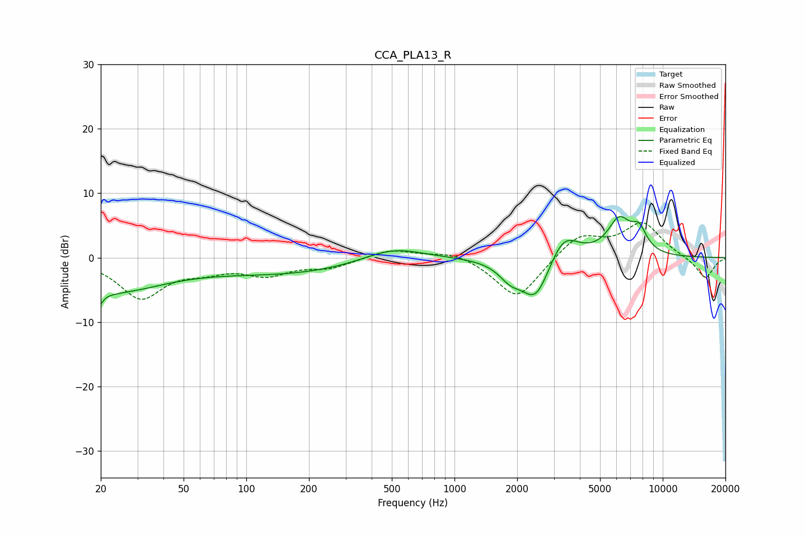

# CCA_PLA13_R
See [usage instructions](https://github.com/jaakkopasanen/AutoEq#usage) for more options and info.

### Parametric EQs
Apply preamp of -6.5 dB when using parametric equalizer.

|   # | Type    |   Fc (Hz) |    Q |   Gain (dB) |
|-----|---------|-----------|------|-------------|
|   1 | Peaking |        20 | 5.4  |        -5.3 |
|   2 | Peaking |        20 | 5.72 |         3.2 |
|   3 | Peaking |        23 | 0.56 |        -4.9 |
|   4 | Peaking |       163 | 0.38 |        -2.4 |
|   5 | Peaking |       503 | 0.94 |         2.3 |
|   6 | Peaking |      1853 | 2.55 |        -2.3 |
|   7 | Peaking |      2460 | 2    |        -6.8 |
|   8 | Peaking |      3328 | 1.96 |         4.6 |
|   9 | Peaking |      6181 | 2.44 |         5.4 |
|  10 | Peaking |      7693 | 3.51 |         3.3 |

### Fixed Band EQs
When using fixed band (also called graphic) equalizer, apply preamp of **-5.5 dB** (if available) and set gains manually with these parameters.

|   # | Type    |   Fc (Hz) |    Q |   Gain (dB) |
|-----|---------|-----------|------|-------------|
|   1 | Peaking |        31 | 1.41 |        -6.1 |
|   2 | Peaking |        62 | 1.41 |        -1.5 |
|   3 | Peaking |       125 | 1.41 |        -2.4 |
|   4 | Peaking |       250 | 1.41 |        -1.4 |
|   5 | Peaking |       500 | 1.41 |         1.4 |
|   6 | Peaking |      1000 | 1.41 |         1.1 |
|   7 | Peaking |      2000 | 1.41 |        -6.6 |
|   8 | Peaking |      4000 | 1.41 |         3.6 |
|   9 | Peaking |      8000 | 1.41 |         5.2 |
|  10 | Peaking |     16000 | 1.41 |        -3.3 |

### Graphs

