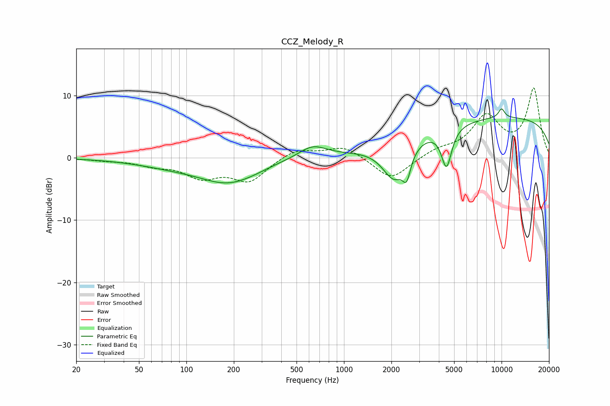

# CCZ_Melody_R
See [usage instructions](https://github.com/jaakkopasanen/AutoEq#usage) for more options and info.

### Parametric EQs
Apply preamp of -8.0 dB when using parametric equalizer.

|   # | Type    |   Fc (Hz) |    Q |   Gain (dB) |
|-----|---------|-----------|------|-------------|
|   1 | Peaking |        84 | 0.58 |        -1.1 |
|   2 | Peaking |       186 | 0.8  |        -3.5 |
|   3 | Peaking |       267 | 1.65 |        -0.2 |
|   4 | Peaking |       632 | 1.57 |         2   |
|   5 | Peaking |      2081 | 1.87 |        -5.9 |
|   6 | Peaking |      2499 | 5.65 |        -3.5 |
|   7 | Peaking |      4475 | 4.3  |        -6.4 |
|   8 | Peaking |     10000 | 0.18 |         2.1 |
|   9 | Peaking |     10000 | 0.18 |         4.4 |
|  10 | Peaking |     10000 | 6    |         1.5 |

### Fixed Band EQs
When using fixed band (also called graphic) equalizer, apply preamp of **-11.3 dB** (if available) and set gains manually with these parameters.

|   # | Type    |   Fc (Hz) |    Q |   Gain (dB) |
|-----|---------|-----------|------|-------------|
|   1 | Peaking |        31 | 1.41 |        -0.3 |
|   2 | Peaking |        62 | 1.41 |        -1   |
|   3 | Peaking |       125 | 1.41 |        -2.8 |
|   4 | Peaking |       250 | 1.41 |        -3.6 |
|   5 | Peaking |       500 | 1.41 |         1.5 |
|   6 | Peaking |      1000 | 1.41 |         1.9 |
|   7 | Peaking |      2000 | 1.41 |        -3.6 |
|   8 | Peaking |      4000 | 1.41 |         1.2 |
|   9 | Peaking |      8000 | 1.41 |         6.3 |
|  10 | Peaking |     16000 | 1.41 |        10.9 |

### Graphs

