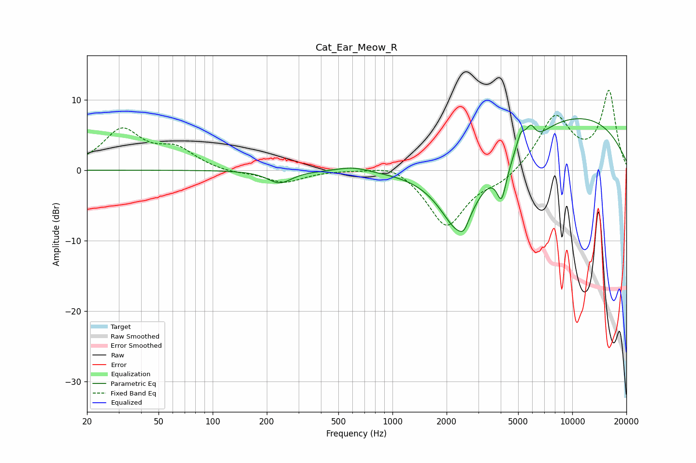

# Cat_Ear_Meow_R
See [usage instructions](https://github.com/jaakkopasanen/AutoEq#usage) for more options and info.

### Parametric EQs
Apply preamp of -7.4 dB when using parametric equalizer.

|   # | Type    |   Fc (Hz) |    Q |   Gain (dB) |
|-----|---------|-----------|------|-------------|
|   1 | Peaking |       236 | 2.11 |        -1.8 |
|   2 | Peaking |       599 | 1.7  |         0.7 |
|   3 | Peaking |      2334 | 1.28 |       -10.2 |
|   4 | Peaking |      2496 | 5.96 |        -1.1 |
|   5 | Peaking |      4044 | 5.69 |        -3.9 |
|   6 | Peaking |      4077 | 2.81 |        -1.6 |
|   7 | Peaking |      5179 | 5.59 |         2.6 |
|   8 | Peaking |      5852 | 2.19 |        -2.4 |
|   9 | Peaking |      5872 | 4.71 |         3.3 |
|  10 | Peaking |     10000 | 0.3  |         7.7 |

### Fixed Band EQs
When using fixed band (also called graphic) equalizer, apply preamp of **-11.4 dB** (if available) and set gains manually with these parameters.

|   # | Type    |   Fc (Hz) |    Q |   Gain (dB) |
|-----|---------|-----------|------|-------------|
|   1 | Peaking |        31 | 1.41 |         5.5 |
|   2 | Peaking |        62 | 1.41 |         2.7 |
|   3 | Peaking |       125 | 1.41 |        -0.4 |
|   4 | Peaking |       250 | 1.41 |        -1.7 |
|   5 | Peaking |       500 | 1.41 |         0.1 |
|   6 | Peaking |      1000 | 1.41 |         1.3 |
|   7 | Peaking |      2000 | 1.41 |        -8   |
|   8 | Peaking |      4000 | 1.41 |        -1.5 |
|   9 | Peaking |      8000 | 1.41 |         7.5 |
|  10 | Peaking |     16000 | 1.41 |        11   |

### Graphs

