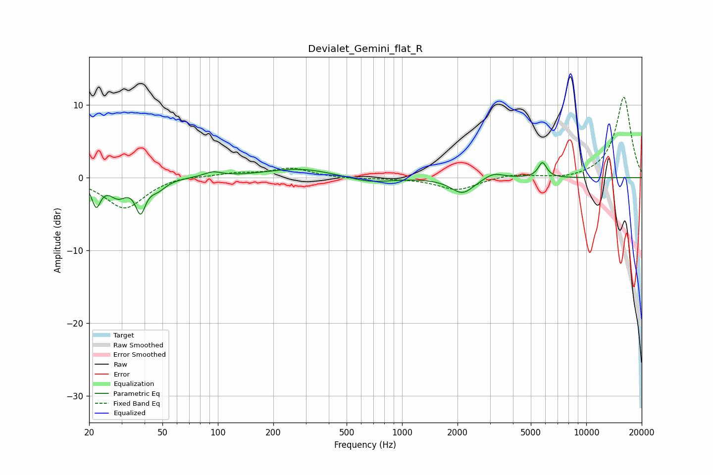

# Devialet_Gemini_flat_R
See [usage instructions](https://github.com/jaakkopasanen/AutoEq#usage) for more options and info.

### Parametric EQs
Apply preamp of -2.2 dB when using parametric equalizer.

|   # | Type    |   Fc (Hz) |    Q |   Gain (dB) |
|-----|---------|-----------|------|-------------|
|   1 | Peaking |        22 | 5.98 |        -3.4 |
|   2 | Peaking |        29 | 3.05 |        -2.2 |
|   3 | Peaking |        38 | 5.33 |        -4   |
|   4 | Peaking |        47 | 3.15 |        -1.3 |
|   5 | Peaking |        94 | 3.08 |         0.7 |
|   6 | Peaking |       277 | 0.78 |         1.3 |
|   7 | Peaking |       665 | 1.23 |        -0.8 |
|   8 | Peaking |      2128 | 2.26 |        -2.2 |
|   9 | Peaking |      3140 | 2.62 |         0.9 |
|  10 | Peaking |      5784 | 6    |         2.1 |

### Fixed Band EQs
When using fixed band (also called graphic) equalizer, apply preamp of **-11.2 dB** (if available) and set gains manually with these parameters.

|   # | Type    |   Fc (Hz) |    Q |   Gain (dB) |
|-----|---------|-----------|------|-------------|
|   1 | Peaking |        31 | 1.41 |        -4.3 |
|   2 | Peaking |        62 | 1.41 |         0.4 |
|   3 | Peaking |       125 | 1.41 |         0.6 |
|   4 | Peaking |       250 | 1.41 |         1.3 |
|   5 | Peaking |       500 | 1.41 |        -0.2 |
|   6 | Peaking |      1000 | 1.41 |        -0.1 |
|   7 | Peaking |      2000 | 1.41 |        -1.7 |
|   8 | Peaking |      4000 | 1.41 |         0.5 |
|   9 | Peaking |      8000 | 1.41 |        -0.3 |
|  10 | Peaking |     16000 | 1.41 |        11.2 |

### Graphs

