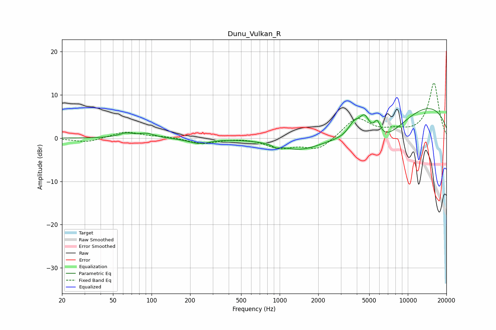

# Dunu_Vulkan_R
See [usage instructions](https://github.com/jaakkopasanen/AutoEq#usage) for more options and info.

### Parametric EQs
Apply preamp of -6.9 dB when using parametric equalizer.

|   # | Type    |   Fc (Hz) |    Q |   Gain (dB) |
|-----|---------|-----------|------|-------------|
|   1 | Peaking |        63 | 2.52 |         1   |
|   2 | Peaking |        91 | 2.21 |         1   |
|   3 | Peaking |       236 | 1.73 |        -1.2 |
|   4 | Peaking |       936 | 5.51 |        -0.6 |
|   5 | Peaking |      1453 | 0.81 |        -3.2 |
|   6 | Peaking |      3810 | 2.9  |         3.3 |
|   7 | Peaking |      4602 | 3.33 |         4.7 |
|   8 | Peaking |      5767 | 5.21 |         3.4 |
|   9 | Peaking |      6179 | 0.49 |       -11.5 |
|  10 | Peaking |      9569 | 0.25 |        12.3 |

### Fixed Band EQs
When using fixed band (also called graphic) equalizer, apply preamp of **-12.9 dB** (if available) and set gains manually with these parameters.

|   # | Type    |   Fc (Hz) |    Q |   Gain (dB) |
|-----|---------|-----------|------|-------------|
|   1 | Peaking |        31 | 1.41 |        -1   |
|   2 | Peaking |        62 | 1.41 |         1.6 |
|   3 | Peaking |       125 | 1.41 |         0.3 |
|   4 | Peaking |       250 | 1.41 |        -1.3 |
|   5 | Peaking |       500 | 1.41 |         0.2 |
|   6 | Peaking |      1000 | 1.41 |        -2.1 |
|   7 | Peaking |      2000 | 1.41 |        -2.8 |
|   8 | Peaking |      4000 | 1.41 |         4.7 |
|   9 | Peaking |      8000 | 1.41 |         1.2 |
|  10 | Peaking |     16000 | 1.41 |        12.8 |

### Graphs

