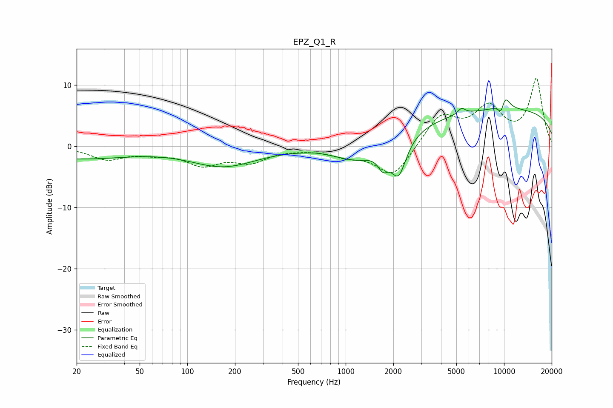

# EPZ_Q1_R
See [usage instructions](https://github.com/jaakkopasanen/AutoEq#usage) for more options and info.

### Parametric EQs
Apply preamp of -7.7 dB when using parametric equalizer.

|   # | Type    |   Fc (Hz) |    Q |   Gain (dB) |
|-----|---------|-----------|------|-------------|
|   1 | Peaking |        20 | 0.42 |        -2   |
|   2 | Peaking |       169 | 0.67 |        -3.2 |
|   3 | Peaking |       651 | 3.53 |         0.1 |
|   4 | Peaking |      1192 | 0.99 |        -2.9 |
|   5 | Peaking |      1722 | 4.33 |        -2.5 |
|   6 | Peaking |      2159 | 2.84 |        -6.2 |
|   7 | Peaking |      5391 | 6    |         1   |
|   8 | Peaking |      9639 | 5.69 |        -2.7 |
|   9 | Peaking |     10000 | 0.18 |         6   |
|  10 | Peaking |     10000 | 3.85 |         3.2 |

### Fixed Band EQs
When using fixed band (also called graphic) equalizer, apply preamp of **-11.2 dB** (if available) and set gains manually with these parameters.

|   # | Type    |   Fc (Hz) |    Q |   Gain (dB) |
|-----|---------|-----------|------|-------------|
|   1 | Peaking |        31 | 1.41 |        -2   |
|   2 | Peaking |        62 | 1.41 |        -0.9 |
|   3 | Peaking |       125 | 1.41 |        -2.7 |
|   4 | Peaking |       250 | 1.41 |        -2.3 |
|   5 | Peaking |       500 | 1.41 |        -0.2 |
|   6 | Peaking |      1000 | 1.41 |        -1.3 |
|   7 | Peaking |      2000 | 1.41 |        -5.1 |
|   8 | Peaking |      4000 | 1.41 |         5   |
|   9 | Peaking |      8000 | 1.41 |         5.8 |
|  10 | Peaking |     16000 | 1.41 |        10.9 |

### Graphs

