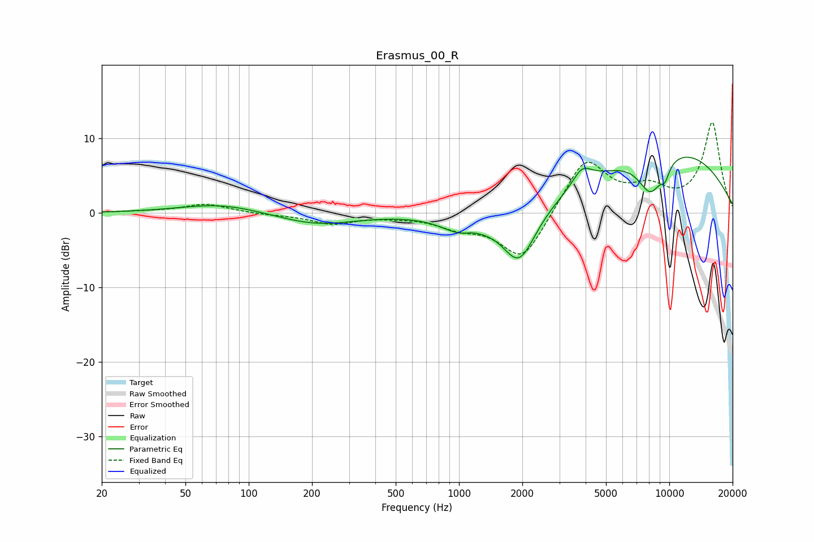

# Erasmus_00_R
See [usage instructions](https://github.com/jaakkopasanen/AutoEq#usage) for more options and info.

### Parametric EQs
Apply preamp of -7.6 dB when using parametric equalizer.

|   # | Type    |   Fc (Hz) |    Q |   Gain (dB) |
|-----|---------|-----------|------|-------------|
|   1 | Peaking |        74 | 0.74 |         1.3 |
|   2 | Peaking |       210 | 0.76 |        -1.6 |
|   3 | Peaking |      1038 | 1.45 |        -2.3 |
|   4 | Peaking |      1148 | 3.27 |         0.5 |
|   5 | Peaking |      1932 | 1.71 |        -7.5 |
|   6 | Peaking |      3849 | 3.04 |         2.3 |
|   7 | Peaking |      8145 | 2.12 |        -5.3 |
|   8 | Peaking |      9548 | 5.99 |        -1.7 |
|   9 | Peaking |      9785 | 0.33 |         8.8 |
|  10 | Peaking |     10000 | 5.98 |         0   |

### Fixed Band EQs
When using fixed band (also called graphic) equalizer, apply preamp of **-12.2 dB** (if available) and set gains manually with these parameters.

|   # | Type    |   Fc (Hz) |    Q |   Gain (dB) |
|-----|---------|-----------|------|-------------|
|   1 | Peaking |        31 | 1.41 |         0.2 |
|   2 | Peaking |        62 | 1.41 |         1.2 |
|   3 | Peaking |       125 | 1.41 |        -0.2 |
|   4 | Peaking |       250 | 1.41 |        -1.4 |
|   5 | Peaking |       500 | 1.41 |        -0.3 |
|   6 | Peaking |      1000 | 1.41 |        -1.6 |
|   7 | Peaking |      2000 | 1.41 |        -6.6 |
|   8 | Peaking |      4000 | 1.41 |         7.4 |
|   9 | Peaking |      8000 | 1.41 |         2.7 |
|  10 | Peaking |     16000 | 1.41 |        12   |

### Graphs

