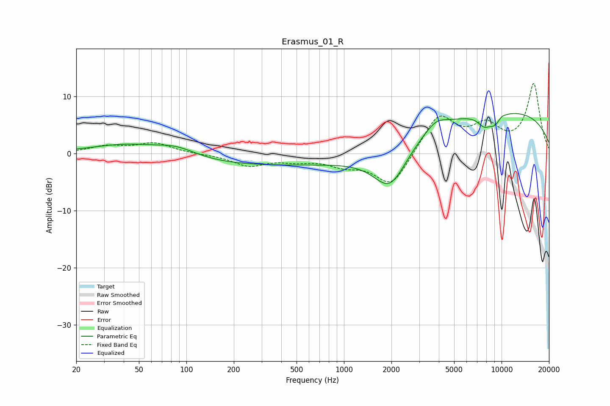

# Erasmus_01_R
See [usage instructions](https://github.com/jaakkopasanen/AutoEq#usage) for more options and info.

### Parametric EQs
Apply preamp of -7.1 dB when using parametric equalizer.

|   # | Type    |   Fc (Hz) |    Q |   Gain (dB) |
|-----|---------|-----------|------|-------------|
|   1 | Peaking |        43 | 0.63 |         1.9 |
|   2 | Peaking |        87 | 1.08 |         1.7 |
|   3 | Peaking |       315 | 0.18 |        -2.1 |
|   4 | Peaking |      1958 | 1.33 |        -7.1 |
|   5 | Peaking |      3547 | 2.49 |        -1.2 |
|   6 | Peaking |      3682 | 1.93 |         3.3 |
|   7 | Peaking |      7753 | 3.27 |        -1.8 |
|   8 | Peaking |      9028 | 3.23 |        -1.8 |
|   9 | Peaking |     10000 | 0.23 |         7.4 |
|  10 | Peaking |     10000 | 5.99 |         0.3 |

### Fixed Band EQs
When using fixed band (also called graphic) equalizer, apply preamp of **-12.3 dB** (if available) and set gains manually with these parameters.

|   # | Type    |   Fc (Hz) |    Q |   Gain (dB) |
|-----|---------|-----------|------|-------------|
|   1 | Peaking |        31 | 1.41 |         1.2 |
|   2 | Peaking |        62 | 1.41 |         1.7 |
|   3 | Peaking |       125 | 1.41 |        -0.1 |
|   4 | Peaking |       250 | 1.41 |        -2.1 |
|   5 | Peaking |       500 | 1.41 |        -1   |
|   6 | Peaking |      1000 | 1.41 |        -1.7 |
|   7 | Peaking |      2000 | 1.41 |        -5.9 |
|   8 | Peaking |      4000 | 1.41 |         6.8 |
|   9 | Peaking |      8000 | 1.41 |         4.2 |
|  10 | Peaking |     16000 | 1.41 |        12   |

### Graphs

