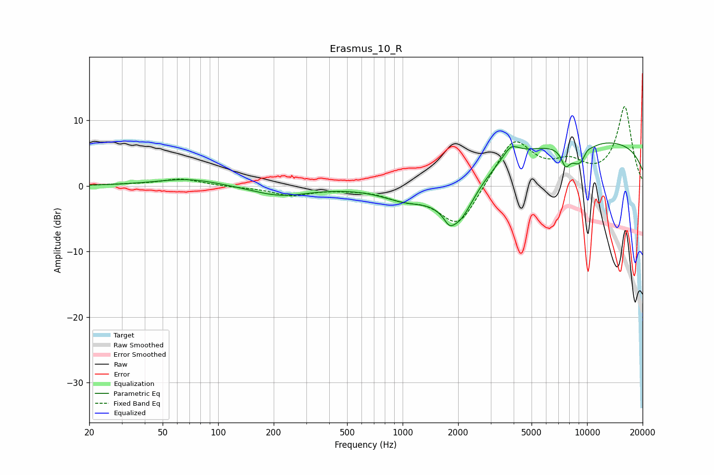

# Erasmus_10_R
See [usage instructions](https://github.com/jaakkopasanen/AutoEq#usage) for more options and info.

### Parametric EQs
Apply preamp of -6.6 dB when using parametric equalizer.

|   # | Type    |   Fc (Hz) |    Q |   Gain (dB) |
|-----|---------|-----------|------|-------------|
|   1 | Peaking |        69 | 0.83 |         1.1 |
|   2 | Peaking |       217 | 0.92 |        -1.5 |
|   3 | Peaking |      1064 | 1    |        -2.4 |
|   4 | Peaking |      1786 | 5.63 |        -1.1 |
|   5 | Peaking |      2000 | 1.52 |        -7.5 |
|   6 | Peaking |      3863 | 3.34 |         2   |
|   7 | Peaking |      7647 | 5.51 |        -2.4 |
|   8 | Peaking |      9083 | 2.58 |        -3.4 |
|   9 | Peaking |     10000 | 0.19 |         7.1 |
|  10 | Peaking |     10000 | 5.77 |         0.7 |

### Fixed Band EQs
When using fixed band (also called graphic) equalizer, apply preamp of **-12.2 dB** (if available) and set gains manually with these parameters.

|   # | Type    |   Fc (Hz) |    Q |   Gain (dB) |
|-----|---------|-----------|------|-------------|
|   1 | Peaking |        31 | 1.41 |         0.2 |
|   2 | Peaking |        62 | 1.41 |         1.1 |
|   3 | Peaking |       125 | 1.41 |        -0.1 |
|   4 | Peaking |       250 | 1.41 |        -1.4 |
|   5 | Peaking |       500 | 1.41 |        -0.3 |
|   6 | Peaking |      1000 | 1.41 |        -1.5 |
|   7 | Peaking |      2000 | 1.41 |        -6.5 |
|   8 | Peaking |      4000 | 1.41 |         7.3 |
|   9 | Peaking |      8000 | 1.41 |         2.8 |
|  10 | Peaking |     16000 | 1.41 |        12   |

### Graphs

